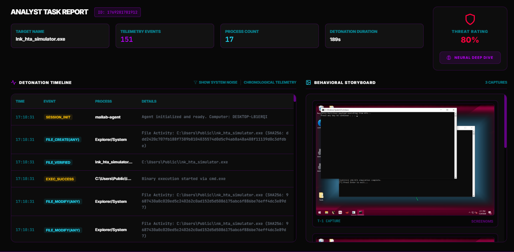
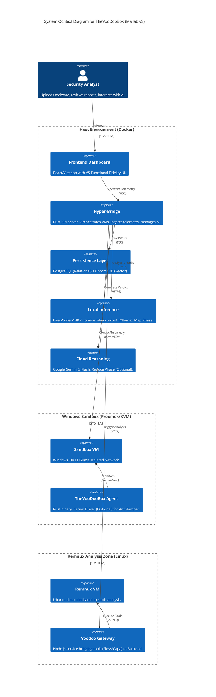

# The VoodooBox (Mallab v3)

**The Ultimate Hybrid AI Malware Analysis Platform**



The VoodooBox is a next-generation forensic orchestration engine that fuses **Kernel-Level Telemetry**, **Advanced Statistical Analysis**, and **Hybrid AI Reasoning** into a single, cohesive "Rave/Hacker" aesthetic dashboard. It doesn't just run malware; it *understands* it.

---

## 🚀 Key Features (v2.8)

### 🧠 Hybrid AI Core (Map-Reduce)
Why choose between privacy and power? The VoodooBox uses a **Hybrid Pipeline**:
*   **Map Phase (Local)**: Raw telemetry is chunked and processed locally by **Ollama** (DeepCoder-14B / nomic-embed-text-v1) to extract privacy-sensitive technical insights without data leakage.
*   **Reduce Phase (Cloud)**: Aggregated insights are sent to **Google Gemini 3 Flash** for high-level reasoning, threat scoring, and report synthesis.
*   *Configurable Strategies: Go fully Local, fully Cloud, or Hybrid.*

### 🕵️ Full-Spectrum Orchestration
*   **Dynamic Windows Sandbox**: Automated detonation with Sysmon, API hooking, and **Optional Kernel Driver** (Classic "The Eye" mode) to capture behaviors.
*   **Remnux Linux Integration**: Seamlessly offloads static analysis to a dedicated Remnux node running **Floss**, **Capa**, **YARA**, and **Manalyze** via the Voodoo Gateway.
*   **Ghidra Automation**: Headless decompilation pipeline that extracts functions and strings, which are then analyzed by the AI for suspicious logic.

### 📊 The Neural Report
Forget raw logs. The Neural Report is a comprehensive intelligence product:
*   **Process Graph**: Real-time process lineage and behavioral tree visualization.
*   **Behavioral Timelines**: Chronological reconstruction of the attack chain.
*   **Threat Score Rings**: Visual risk assessment (0-100).
*   **Actionable Verdicts**: "Malicious", "Suspicious", or "Benign" with high-confidence reasoning.

### 🕵️ Active Investigator (MCP)
The VoodooBox is an **Agentic Node**. Utilizing the **Model Context Protocol (MCP)**, it exposes a suite of investigative tools to external AI agents:
*   **Virtual Operations**: Rollback VMs, trigger Ghidra analysis, and decompile code.
*   **Forensic Memory**: AI saves and retrieves "Forensic Notes" during analysis to maintain continuity across sessions.
*   **Intelligence RAG**: Semantic search against the local malware knowledge base (ChromaDB) to ground findings in peer-reviewed methodology.

### 🕸️ Activity Flow (Process Graph)
*   **Real-Time Visualization**: Watch the process tree grow in real-time as the malware executes.
*   **Interactive Nodes**: Click on any process to filter telemetry, see loaded DLLs, network connections, and registry modifications.

---

## 🏗️ Architecture



The VoodooBox operates on a distributed microservices architecture:

| Component | Tech Stack | Role |
| :--- | :--- | :--- |
| **Backend** | **Rust** (Actix-Web, SQLx) | High-performance API, orchestration, and state management. |
| **Frontend** | **React** (TypeScript, Tailwind) | "Cyber-Rave" dashboard with real-time WebSockets. |
| **Database** | **PostgreSQL** | Relational storage for tasks, telemetry, and reports. |
| **Agent** | **Rust** (Windows API) | Lightweight monitor. Kernel Driver optional for Anti-Tamper. |
| **Gateway** | **Node.js** | Bridge service for Remnux tools and MCP integration. |

---

## ⚡ Quick Start

### Prerequisites
*   **Docker & Docker Compose**
*   **Proxmox** (or a dedicated Windows VM for the sandbox)
*   **Ollama** (running locally or on a network node)

### Deployment

1.  **Clone the Repository**:
    ```bash
    git clone https://github.com/Sagz9000/TheVooDooBox.git
    cd TheVooDooBox-main
    ```

2.  **Configure Environment**:
    ```bash
    cp .env.example .env
    # Edit .env: Set DB credentials, API Keys, and IP addresses for Proxmox/Remnux.
    ```

3.  **Launch the Stack**:
    ```bash
    docker-compose up -d --build
    ```

4.  **Access the Dashboard**:
    *   **Frontend**: `http://localhost:3000`
    *   **Backend API**: `http://localhost:8080`

---

## 📚 Documentation

Detailed documentation is available in the `docs/` directory:

| Guide | Description |
| :--- | :--- |
| **[01_OVERVIEW.md](docs/01_OVERVIEW.md)** | Conceptual capability overview. |
| **[02_ARCHITECTURE.md](docs/02_ARCHITECTURE.md)** | Deep dive into system design and data flow. |
| **[07_INSTALLATION.md](docs/07_INSTALLATION.md)** | Step-by-step setup guide. |
| **[15_ANALYSIS.md](docs/15_ANALYSIS.md)** | Analyst's manual for running tasks. |
| **[21_REMNUX_VM_DEPLOYMENT.md](docs/21_REMNUX_VM_DEPLOYMENT.md)** | Setting up the Remnux integration. |

---

## 🤝 Contributing

We welcome contributions! Please check the **[Architecture Guide](docs/02_ARCHITECTURE.md)** before submitting Pull Requests.

*Built with ❤️ (and a lot of caffeine) by the AntiCode Team.*
