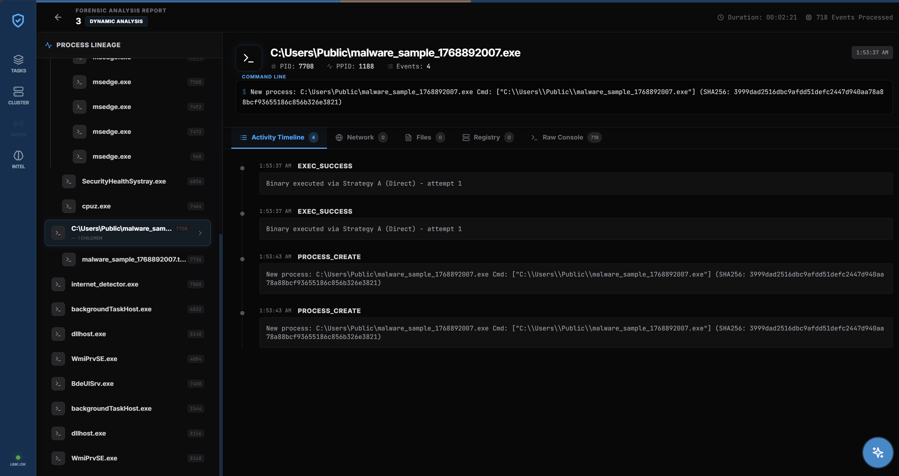
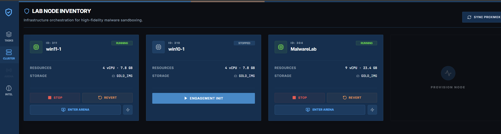
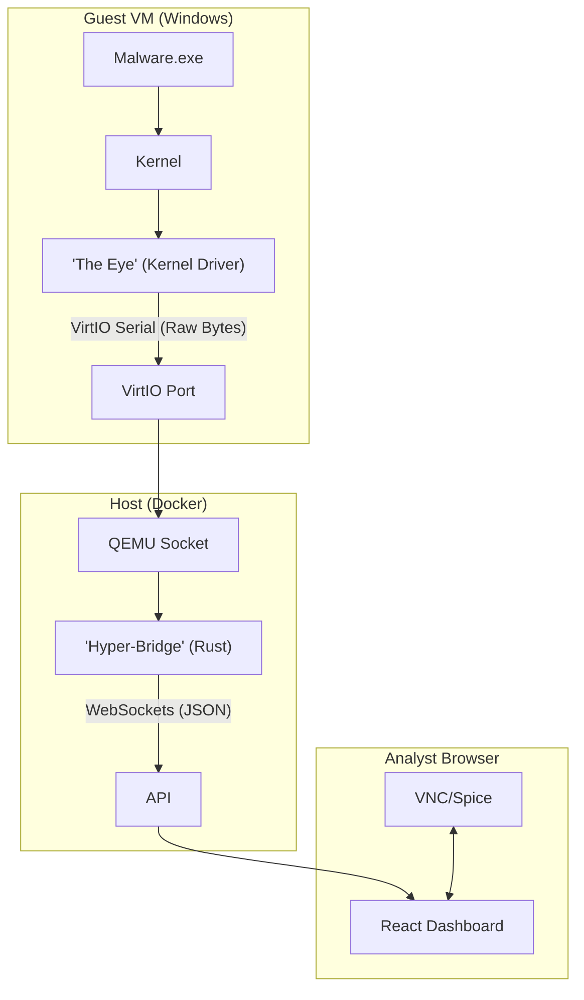

# TheVooDooBox: Interactive Malware Analysis Engine

> **"From Logging to Streaming"**

TheVooDooBox is a research prototype designed to replicate the **real-time, interactive experience** of platforms Unlike traditional sandboxes (Cuckoo/CAPE) that rely on batch processing and post-execution logs, TheVooDooBox focuses on instantaneous "Kernel-to-Pixel" streaming.

## 🚀 Key Features

*   **Live Interaction**: Control the malware execution flow. Click buttons, solve CAPTCHAs, and explore the file system *while* the malware is running.
*   **Real-Time Telemetry**: See "Process Created", "DNS Request", and "File Dropped" events on your dashboard the moment they happen (milliseconds latency).
*   **Kernel-Level Monitoring**: A custom Windows Kernel Driver ("The Eye") captures events at the source, bypassing user-mode hooks.
*   **High-Performance Bridge**: A Rust-based backend ("Hyper-Bridge") ingests millions of driver events and streams them via WebSockets to the UI.
*   **Ghidra Intelligence**: Integrated static analysis. Automatically decompile functions and view assembly for any uploaded binary, cross-referencing static findings with dynamic behavior.

## 🖼️ Gallery

### Analysis Queue & Task Management

### Live Forensic Timeline

### Detailed Analysis Report

### Analyst Multi-Window Workspace

## 🏗️ Architecture

## 🛠️ Technology Stack

*   **Kernal Driver**: C/C++ (Windows Driver Kit)
*   **Backend Bridge**: Rust (Tokio, Actix)
*   **Frontend**: React, TypeScript, TailwindCSS
*   **Infrastructure**: QEMU/KVM, Docker, Postgres

## 🚦 Status: PROTOTYPE (Functional)
The system is now functional, providing real-time telemetry and forensic analysis capabilities.

## 📥 Getting Started
(Coming Soon)
