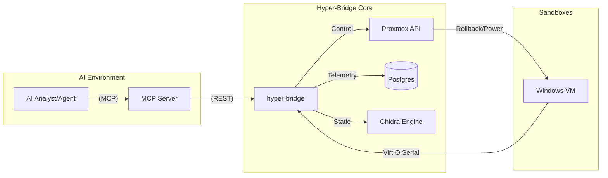

# Hyper-Bridge & MCP Integration

**Hyper-Bridge** is the central nervous system of TheVooDooBox. It coordinates every component of the platform, from low-level VM snapshots to high-level AI forensic triage.

## 🏗️ Design Philosophy

Hyper-Bridge was designed with three core goals:
1.  **Hardware Abstraction**: Provide a uniform API for Proxmox/KVM operations, shielding the analyst from infrastructure complexity.
2.  **Stream Multiplexing**: Aggregating raw event structs from the Windows Kernel Driver and distributing them to the database, UI, and AI analyzer simultaneously.
3.  **Agentic Interactivity**: Enable AI models to not just "view" logs, but "act" upon the environment (Snapshots, Process kills, etc.).

### Tech Stack
*   **Core**: Rust (Actix-Web, Tokio) for high-performance concurrency.
*   **Persistence**: PostgreSQL (SQLx) for forensic event storage.
*   **Communication**: WebSocket (real-time telemetry) and REST (orchestration).

## 🗄️ Storage Strategy: Why PostgreSQL instead of ELK?

While many security platforms use ELK (Elasticsearch, Logstash, Kibana) for logging, TheVooDooBox intentionally uses **PostgreSQL**.

### 1. Relational Lineage
Malware behavior is inherently relational. Identifying a process tree (Parent -> Child -> Grandchild) is a graph/relational problem. PostgreSQL handles recursive queries and complex JOINs for process lineage significantly more efficiently than a document store like Elasticsearch.

### 2. Resource Efficiency & Performance
Malware analysis labs often run on constrained hardware (laptops or single-server nodes) alongside compute-heavy VMs and local LLMs.
*   **PostgreSQL**: Consumes ~100MB of RAM at idle and scales linearly. It is written in C and pairs perfectly with the high-concurrency Rust backend.
*   **ELK Stack**: Requires a minimum of 4-8GB of dedicated RAM just for the JVM (Java Virtual Machine) heap, even with zero ingested logs. Adding Logstash and Kibana increases this overhead significantly, often stalling other critical lab components.

### 3. ACID Compliance
In malware analysis, data integrity is critical. If the analyst triggers a "Kill" command or the VM crashes, we must ensure the preceding events were safely committed to disk. PostgreSQL's ACID compliance ensures that telemetry is never lost in a volatile buffer, whereas ELK's "Eventually Consistent" model can lose the most critical final milliseconds of an infection chain.

### 4. Simplified Orchestration
Using PostgreSQL allows the backend to handle both **Forensic Telemetry** and **Lab Metadata** (VM states, task queues, user settings) in a single, consistent database engine, reducing the complexity of the Docker environment.

## 🤖 The MCP Server (Model Context Protocol)

TheVooDooBox implements the **Model Context Protocol (MCP)**, allowing AI agents (like Claude or GPT-4) to use the platform's forensic capabilities as native "tools."

### Why it exists
Traditional AI analysis is passive. By exposing Hyper-Bridge as an MCP server, we turn the AI into an **Active Investigator**. The AI can decide to rollback a VM, trigger a Ghidra scan, or fetch the last 100 process events on its own initiative to answer a complex hypothesis.

### Exposed Tools
The `mcp-server` service translates AI intent into Hyper-Bridge actions:

| Tool | Action |
| :--- | :--- |
| `list_lab_vms` | Queries the Proxmox cluster for current sandbox states. |
| `rollback_vm` | Instantly reverts a sandbox to the `GOLD_IMAGE` snapshot. |
| `get_vm_telemetry` | Fetches filtered, high-fidelity kernel events from the DB. |
| `trigger_ghidra_analysis` | Initiates headless static analysis on a suspected binary. |
| `query_static_functions` | Searches Ghidra findings for specific code patterns. |
| `decompile_function` | Generates pseudocode for any function the AI wants to inspect. |

## 📐 Architecture Flow

## 🛠️ Usage for Developers

The MCP server is a Python-based FastAPI service located in `/mcp-server`. It communicates with the main Hyper-Bridge via internal Docker networking.

### Configuration
In your `.env` file:
*   `BACKEND_URL`: URL of the Hyper-Bridge (`http://hyper-bridge:8080`).
*   `GHIDRA_API`: URL of the static engine (`http://ghidra:8000`).

To connect an external Agentic UI (like Claude Desktop) to the lab, you can point it to the MCP server's SSE endpoint at `http://<server_ip>:8001`.
