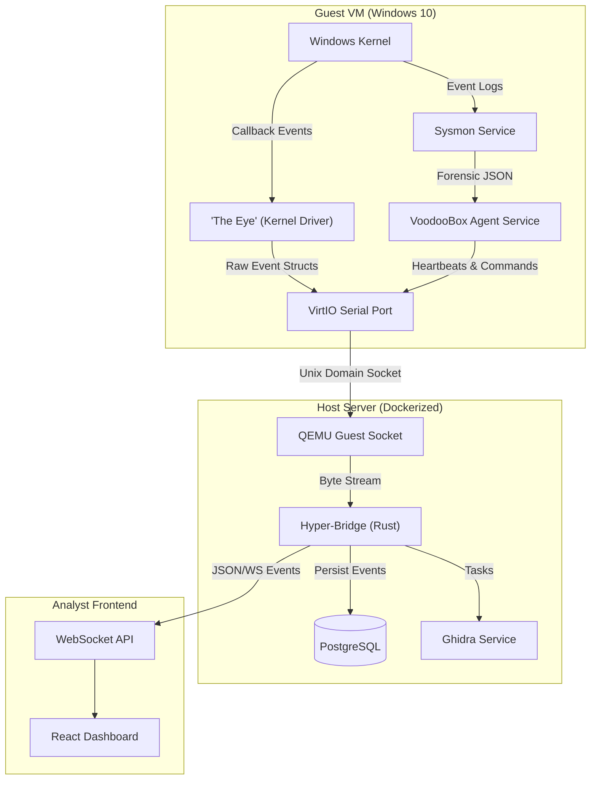

# Architecture & Logic

TheVooDooBox operates on a highly efficient "Stream-Analysis" architecture, separated into three distinct layers: The Guest Agent (Kernel), The Host Bridge (Backend), and The Analyst Interface (Frontend).

## Logical Data Flow



## Component Details

### 1. "The Eye" (Kernel Driver)
*   **Device**: `\Device\VoodooBoxEye`
*   **Symbolic Link**: `\DosDevices\VoodooBoxEye`
*   **Mechanism**: Uses `PsSetCreateProcessNotifyRoutineEx` for process tracking and `ObRegisterCallbacks` for handle stripping protection.
*   **Event Struct**:
    ```c
    typedef struct _DRIVER_EVENT {
        ULONG EventType;      // 0=ProcCreate, 1=NetConnect, 2=RegSet
        ULONG ProcessId;
        ULONG ParentId;
        WCHAR Details[256];   // Fixed size buffer for zero-copy speed
        LARGE_INTEGER Timestamp;
    } DRIVER_EVENT;
    ```

### 2. Hyper-Bridge (Backend)
*   **Tech Stack**: Rust (Actix-Web, Tokio, SQLx).
*   **Concurrency**: Uses a centralized `EventBus` (Tokio Broadcast Channel) to fan-out kernel events to:
    1.  **WebSocket Actors**: Connected frontend clients.
    2.  **Database Writer**: Async buffering to Postgres.
    3.  **AI Analyzer**: Triggered on threshold events.

## Database Schema (`voodoobox` DB)

### `tasks` Table
| Column | Type | Description |
|--------|------|-------------|
| `id` | UUID | Primary Key |
| `status` | VARCHAR | `pending`, `running`, `completed` |
| `verdict` | VARCHAR | `malicious`, `suspicious`, `benign` |
| `risk_score` | INT | 0-100 |

### `analysis_reports` Table
Stores the final output of the AI Analyst.
| Column | Type | Description |
|--------|------|-------------|
| `task_id` | UUID | Foreign Key -> tasks.id (Unique) |
| `risk_score` | INT | 0-100 |
| `threat_level` | VARCHAR | BENIGN, SUSPICIOUS, MALICIOUS |
| `summary` | TEXT | Executive Summary (AI generated) |
| `suspicious_pids` | INT[] | List of PIDs involved in the attack chain |
| `mitre_tactics` | TEXT[] | e.g. ["Persistence", "Privilege Escalation"] |
| `forensic_report_json`| JSONB | Full structured report (timeline, artifacts) |

## API Specifications

### REST Endpoints (`/api`)

| Method | Endpoint | Description |
|--------|----------|-------------|
| `POST` | `/tasks` | Submit a new file for analysis. Body: Multipart form. |
| `GET` | `/tasks` | List recent analysis tasks. |
| `GET` | `/tasks/{id}` | Get status and metadata for a specific task. |
| `POST` | `/tasks/{id}/analyze` | Trigger manual AI analysis for a running/completed task. |
| `GET` | `/tasks/{id}/ai-report` | Fetch the generated AI report. |
| `GET` | `/tasks/{id}/ghidra` | Fetch static analysis findings (functions, strings). |

### WebSocket (`/ws`)
*   **Protocol**: JSON-over-WS
*   **Events**:
    *   `TELEMETRY`: Real-time kernel event (Process, Network, File).
    *   `AGENT_STATUS`: Heartbeat from the VM agent (Idle, Busy, Error).
    *   `CONSOLE_LOG`: Standard output from the guest instrumentation.

### 4. Frontend Dashboard
*   **Language**: React, TypeScript, TailwindCSS
*   **Role**: A single-page application (SPA) that combines the VNC video stream with the scrolling telemetry log and AI analysis panels.

> [!NOTE]
> For a deep dive into how remote console sessions are proxied between the browser and Proxmox, see [VNC & SPICE Integration](10_VNC_SPICE_INTEGRATION.md).
