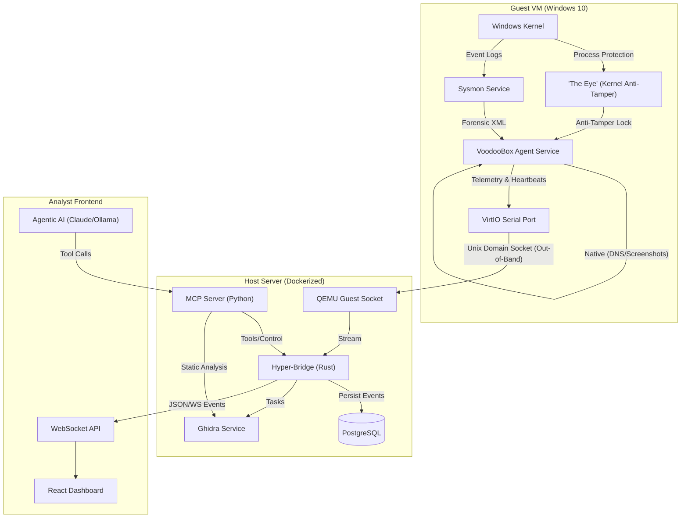

# Architecture & Logic

TheVooDooBox operates on a highly efficient "Stream-Analysis" architecture, separated into three distinct layers: The Guest Agent (Kernel), The Host Bridge (Backend), and The Analyst Interface (Frontend).

## Logical Data Flow



## Component Details

### 1. "The Eye" (Kernel Anti-Tamper)
*   **Role**: **Self-Protection Only**.
*   **Mechanism**: Uses `IOCTL_PROTECT_PROCESS` to prevent the Agent service from being terminated by malware.
*   **Telemetry Source**: The User-Mode Agent consumes **Sysmon** events for process creation and network activity, ensuring stability and compatibility. It supplements this with **Native Telemetry** (File Hashing, Screenshots, DNS Cache). *Future Goal: Migrate entirely to custom Kernel Callbacks (Path B).*

### 2. Transport Modes: In-Band vs. Out-of-Band
    ```c
    typedef struct _DRIVER_EVENT {
        ULONG EventType;      // 0=ProcCreate, 1=NetConnect, 2=RegSet
        ULONG ProcessId;
        ULONG ParentId;
        WCHAR Details[256];   // Fixed size buffer for zero-copy speed
        LARGE_INTEGER Timestamp;
    } DRIVER_EVENT;
    ```

### 2. Transport Modes: In-Band vs. Out-of-Band
TheVooDooBox supports two primary communication channels between the Guest Agent and the Hyper-Bridge:

*   **In-Band (TCP/IP)**: The default configuration. The Agent connects to the backend over a standard network interface (e.g., `192.168.1.1:9001`). This is simple to setup but visible to advanced malware monitoring the network stack.
*   **Out-of-Band (VirtIO Serial)**: The "Gold Standard" for stealth. Communication occurs over a virtual serial hardware device.
    *   **Bypasses `tcpip.sys`**: Data never enters the Windows network stack.
    *   **Hardware Layer**: QEMU/VirtIO maps the Guest's serial port to a Unix Domain Socket on the host. 
    *   **Stealth**: Telemetry traffic is invisible to packet sniffers (Wireshark) and firewall logs within the VM.

### 3. Hyper-Bridge (Backend)
*   **Tech Stack**: Rust (Actix-Web, Tokio, SQLx).
*   **Concurrency**: Uses a centralized `EventBus` (Tokio Broadcast Channel) to fan-out kernel events to:
    1.  **WebSocket Actors**: Connected frontend clients.
    2.  **Database Writer**: Async buffering to Postgres.
    3.  **AI Analyzer**: Triggered on threshold events.

## Database Schema (`voodoobox` DB)

### `tasks` Table
| Column | Type | Description |
|--------|------|-------------|
| `id` | UUID | Primary Key |
| `status` | VARCHAR | `pending`, `running`, `completed` |
| `verdict` | VARCHAR | `malicious`, `suspicious`, `benign` |
| `risk_score` | INT | 0-100 |

### `analysis_reports` Table
Stores the final output of the AI Analyst.
| Column | Type | Description |
|--------|------|-------------|
| `task_id` | UUID | Foreign Key -> tasks.id (Unique) |
| `risk_score` | INT | 0-100 |
| `threat_level` | VARCHAR | BENIGN, SUSPICIOUS, MALICIOUS |
| `summary` | TEXT | Executive Summary (AI generated) |
| `suspicious_pids` | INT[] | List of PIDs involved in the attack chain |
| `mitre_tactics` | TEXT[] | e.g. ["Persistence", "Privilege Escalation"] |
| `forensic_report_json`| JSONB | Full structured report (timeline, artifacts) |

## AI Analysis & Synthesis Pipeline

TheVooDooBox uses a multi-stage pipeline to convert raw kernel telemetry into actionable intelligence:

1.  **Noise Filtering (Rust)**: Aggressively filters the stream to remove background system activity. Only high-value event IDs (Process Create, Network, File Create, Remote Thread) from relevant process lineages are preserved.
2.  **PID Menu Extraction (Clerk Mode)**: The system extracts all unique, valid PIDs from the filtered telemetry and provides them as a "Factual Cheat Sheet" to the model. This prevents hallucination of process identifiers.
3.  **Context Enrichment**: Ghidra static findings (decompiled code) and ChromaDB RAG results (MITRE TTPs/Forensic Templates) are injected into the prompt.
4.  **Paranoid Reasoning (Detective Mode)**: The LLM processes the data with a high-integrity persona ("Elite Threat Hunter"). It is biased toward identifying malicious intent in otherwise "benign-looking" tool usage (e.g., `certutil` being used as a downloader).
5.  **Deterministic Synthesis**: Temperature is locked at `0.05` to ensure the final report is grounded in the provided telemetry while allowing for a "thinking budget" to interpret behavior.

## API Specifications

### REST Endpoints (`/api`)

| Method | Endpoint | Description |
|--------|----------|-------------|
| `POST` | `/tasks` | Submit a new file for analysis. Body: Multipart form. |
| `GET` | `/tasks` | List recent analysis tasks. |
| `GET` | `/tasks/{id}` | Get status and metadata for a specific task. |
| `POST` | `/tasks/{id}/analyze` | Trigger manual AI analysis for a running/completed task. |
| `GET` | `/tasks/{id}/ai-report` | Fetch the generated AI report. |
| `GET` | `/tasks/{id}/ghidra` | Fetch static analysis findings (functions, strings). |

### WebSocket (`/ws`)
*   **Protocol**: JSON-over-WS
*   **Events**:
    *   `TELEMETRY`: Real-time kernel event (Process, Network, File).
    *   `AGENT_STATUS`: Heartbeat from the VM agent (Idle, Busy, Error).
    *   `CONSOLE_LOG`: Standard output from the guest instrumentation.

### 4. Frontend Dashboard
*   **Language**: React, TypeScript, TailwindCSS
*   **Role**: A single-page application (SPA) that combines the VNC video stream with the scrolling telemetry log and AI analysis panels.

> [!NOTE]
> For a deep dive into how remote console sessions are proxied between the browser and Proxmox, see [VNC & SPICE Integration](10_VNC_SPICE_INTEGRATION.md).
