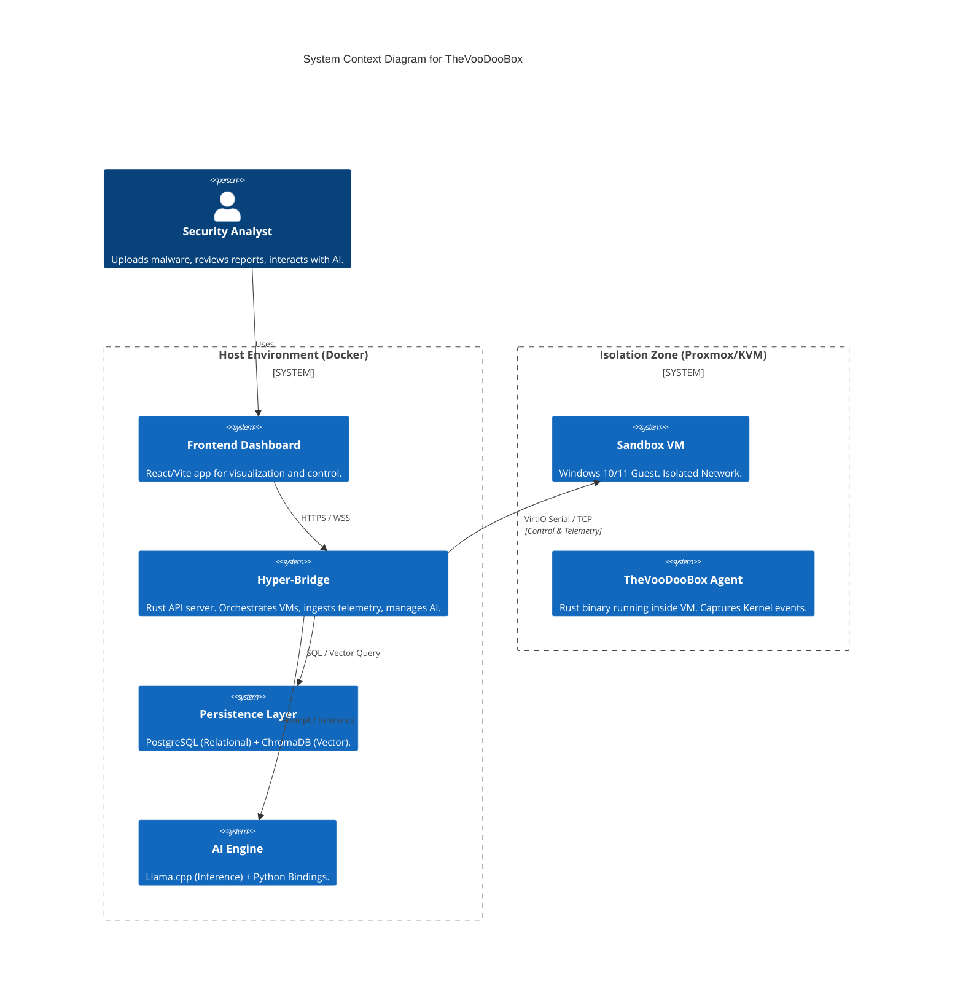

# TheVooDooBox System Architecture

## 1. High-Level Design

TheVooDooBox is a **hybrid forensic platform** that acts as an orchestration layer between a secure, isolated sandbox environment and a modern AI analysis engine. It is built to be **self-hosted**, **offline-capable**, and **modular**.

### System Context Diagram



---

## 2. Container Architecture

The system runs as a multi-container Docker application (`docker-compose.yaml`).

| Service | Image/Build | Port | Description |
| :--- | :--- | :--- | :--- |
| **hyper-bridge** | `./backend` | `8080` (API), `9001` (Agent) | Core logic. Rust-based Actix server. |
| **frontend** | `./frontend` | `3000` | React web application. |
| **db** | `postgres:15-alpine` | `5432` | Stores Tasks, Events, and Reports. |
| **chromadb** | `chromadb/chroma` | `8002` | Stores embeddings for RAG (Retrieval Augmented Generation). |
| **ghidra** | `./ghidra` | `8005` | Headless Ghidra server for static analysis. |
| **mcp-server** | `./mcp-server` | `8001` | Model Context Protocol server for IDE integration. |

---

## 3. Database Schema

The persistence layer uses **PostgreSQL**. Key tables include:

### `tasks`
Tracks the lifecycle of a submitted sample.
- `id` (UUID): Unique Task ID.
- `filename` (Text): Name of submitted file.
- `file_hash` (Text): SHA256 hash.
- `status` (Text): `QUEUED`, `RUNNING`, `ANALYZING`, `COMPLETED`.
- `verdict` (Text): AI-determined verdict (`MALICIOUS`, `BENIGN`).
- `risk_score` (Int): 0-100 score.
- `sandbox_id` (Text): ID of the specific VM used.

### `events`
Stores raw telemetry streamed from the Agent.
- `id` (Serial): Primary Key.
- `task_id` (UUID): Link to parent Task.
- `event_type` (Text): `PROCESS_CREATE`, `network_connect`, `file_create`, etc.
- `timestamp` (BigInt): Unix epoch.
- `process_id` (Int): PID of the actor.
- `details` (JSON): Context-specific data (IPs, Paths, Registry Keys).
- `digital_signature` (Text): status of the binary (e.g., `Signed by Microsoft`).

### `analysis_reports`
Stores the final AI-generated output.
- `task_id` (UUID): Unique Link.
- `report_text` (Text): Full markdown report.
- `forensic_report_json` (JSONB): Structured findings (Timeline, IOCs).
- `generated_at` (Timestamp).

### `virustotal_cache`
Caches external intelligence to save API quota.
- `hash` (Text PK): SHA256.
- `data` (JSONB): Full VT Report.
- `scanned_at` (Timestamp).

---

## 4. API Reference (Hyper-Bridge)

The backend exposes a REST API on port `8080`.

### VM Management
- `GET /vms`: List all Proxmox VMs and their status.
- `POST /vms/{node}/{vmid}/status`: Start, Stop, or Reset a VM.
- `POST /vms/{node}/{vmid}/revert`: Rollback VM to "Gold Image".
- `POST /vms/{node}/{vmid}/vnc`: Get a VNC WebSocket ticket.

### Analysis Actions
- `POST /vms/actions/submit`: Upload a file for detonation.
    - **Multipart Form**: `file`, `analysis_duration` (seconds).
- `POST /vms/actions/terminate`: Kill a process in the active VM.
- `POST /vms/actions/exec`: Run a command/URL in the active VM.

### Reporting
- `GET /reports/{task_id}`: Retrieve the full forensic report.
- `GET /reports/{task_id}/events`: Stream raw events for the timeline UI.

---

## 5. Security & Isolation

### Network Segregation
- **Host-Only Network**: The Sandbox VMs live on a dedicated virtual network (e.g., `vmbr1`) with no routing to the host's LAN.
- **Strict Firewall**: The Guest VM can *only* talk to the Hyper-Bridge on port `9001` (Telemetry) and `8080` (Artifact Uploads).
- **No Internet (Default)**: Outbound internet is blocked by default to prevent C2 callbacks from reaching real threat actors. (Configurable for honey-potting).

### The "Eye" (Kernel Driver)
The Agent is protected by a custom Kernel Driver (`voodoobox_eye.sys`).
- **Anti-Tamper**: Strips `PROCESS_TERMINATE` rights from any process attempting to open a handle to the Agent.
- **Callback Registration**: Uses `PsSetCreateProcessNotifyRoutine` to capture process execution at the kernel level, ensuring no user-mode rootkit can hide execution.

---

## 6. AI & RAG Pipeline

For a detailed breakdown of the Artificial Intelligence architecture, including Prompt Engineering, Vector Embeddings, and the Hallucination Control Protocol, please see [03_AI_RAG.md](03_AI_RAG.md).

---

## 7. Build & Deployment

### Backend (Rust/Actix)
```bash
cd backend
cargo build --release
```

### Agent (Rust/Windows)
The agent is cross-compiled from Linux using MinGW or built natively on Windows.
```bash
# Cross-compile
cargo build --target x86_64-pc-windows-gnu --release
```

For full deployment instructions, see [13_AGENT_DEPLOYMENT.md](13_AGENT_DEPLOYMENT.md).
