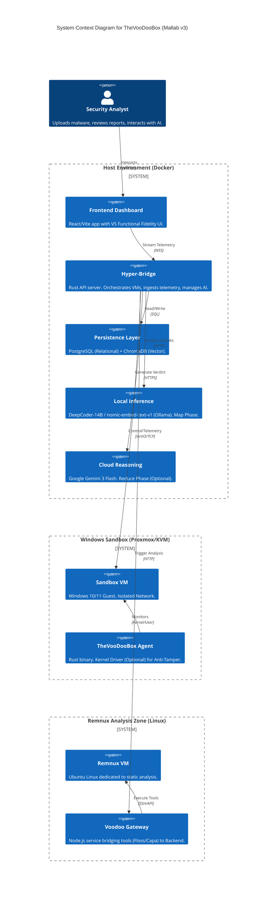

# TheVooDooBox System Architecture

## 1. High-Level Design

TheVooDooBox is a **hybrid forensic platform** that acts as an orchestration layer between a secure, isolated sandbox environment and a modern AI analysis engine. It is built to be **self-hosted**, **offline-capable**, and **modular**.

### System Context Diagram

---

## 2. Container Architecture

The system runs as a multi-container Docker application (`docker-compose.yaml`).

| Service | Image/Build | Port | Description |
| :--- | :--- | :--- | :--- |
| **hyper-bridge** | `./backend` | `8080` (API), `9001` (Agent) | Core logic. Rust-based Actix server. |
| **frontend** | `./frontend` | `3000` | React web application. |
| **db** | `postgres:15-alpine` | `5432` | Stores Tasks, Events, and Reports. |
| **chromadb** | `chromadb/chroma` | `8002` | Stores embeddings for RAG (Retrieval Augmented Generation). |
| **remnux-gateway** | `./remnux` | `8090` | Node.js bridge to Remnux tools (can be remote). |

---

## 3. AI Pipeline (Map-Reduce)

TheVooDooBox uses a **Map-Reduce** architecture to process large volumes of telemetry while respecting privacy boundaries.

---

## 4. Database Schema

The persistence layer uses **PostgreSQL**. Key tables include:

### `tasks`
Tracks the lifecycle of a submitted sample.
- `id` (UUID): Unique Task ID.
- `filename` (Text): Name of submitted file.
- `file_hash` (Text): SHA256 hash.
- `status` (Text): `QUEUED`, `RUNNING`, `ANALYZING`, `COMPLETED`.
- `verdict` (Text): AI-determined verdict (`MALICIOUS`, `BENIGN`).
- `risk_score` (Int): 0-100 score.
- `mitre_matrix` (JSONB): Mapped tactics and techniques.
- `remnux_status` (Text): Status of the Linux static analysis.

### `events`
Stores raw telemetry streamed from the Agent.
- `id` (Serial): Primary Key.
- `task_id` (UUID): Link to parent Task.
- `event_type` (Text): `PROCESS_CREATE`, `network_connect`, `file_create`, `registry_set`.
- `timestamp` (BigInt): Unix epoch.
- `process_id` (Int): PID of the actor.
- `details` (JSON): Context-specific data (IPs, Paths, Registry Keys).

---

## 5. Security & Isolation

### Network Segregation
- **Host-Only Network**: The Sandbox VMs live on a dedicated virtual network (e.g., `vmbr1`) with no routing to the host's LAN.
- **Strict Firewall**: The Guest VM can *only* talk to the Hyper-Bridge on port `9001` (Telemetry) and `8080` (Artifact Uploads).
- **No Internet (Default)**: Outbound internet is blocked by default to prevent C2 callbacks from reaching real threat actors. (Configurable for honey-potting).

### The "Eye" (Kernel Driver) - *Optional*
The Agent can be hardened by a custom Kernel Driver (`voodoobox_eye.sys`).
- **Optional**: The system functions fully without this driver. Use it for **Anti-Tamper** capabilities.
- **Anti-Tamper**: Strips `PROCESS_TERMINATE` rights from any process attempting to open a handle to the Agent.
- **Callback Registration**: Uses `PsSetCreateProcessNotifyRoutine` to capture process execution at the kernel level, ensuring no user-mode rootkit can hide execution.
