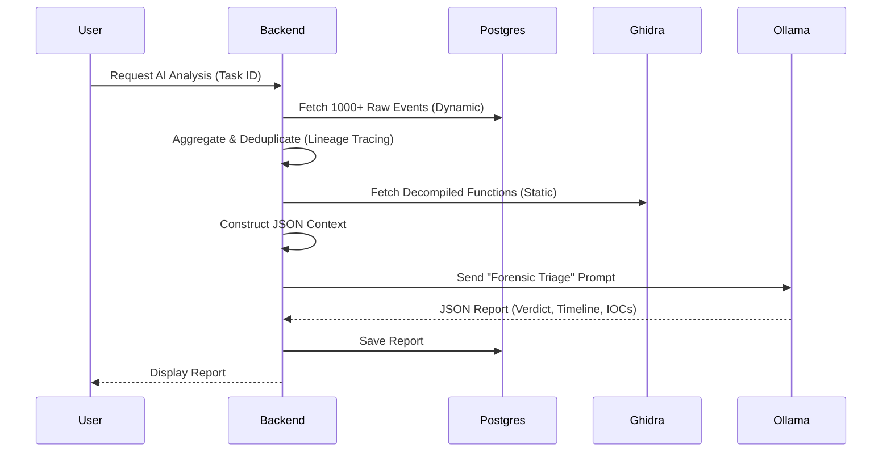

# AI Analyst & RAG Pipeline

TheVooDooBox employs a specialized AI Analyst to act as a "Force Multiplier" for human researchers. Instead of just dumping logs, the system uses a **Hybrid RAG (Retrieval-Augmented Generation)** approach to synthesize both active behavior and static code analysis into a coherent forensic narrative.

## The Theory: Hybrid Context

Traditional RAG often retrieves random chunks of text. Our approach is structured:
1.  **Dynamic Context**: We aggregate the last 60 seconds of Kernel Driver events (Process Tree, Network Connections, Registry Mods).
2.  **Static Context**: We inject decompiled function signatures and string references from Ghidra.
3.  **Prompt Engineering**: We utilize a specialized "Forensic Triage" system prompt to align the LLM's analysis with the perspective of a Senior Malware Researcher.

## The Pipeline



## Prompt Engineering & Anti-Hallucination

We use a high-temperature (creative) model for narrative generation but constrain it with strict **System Instructions**:

> "You are a Senior Malware Researcher. Analyze ONLY the provided telemetry. If the logs show only a benign installer, mark it BENIGN. Do NOT hallucinate 'PowerShell' attacks if none exist."

### Context Structure
The JSON context sent to the LLM looks like this:

```json
{
  "scan_id": "aa12-bb34",
  "processes": [
    {
      "pid": 4104,
      "image_name": "malware.exe",
      "network_activity": [{"dest": "93.184.216.34", "port": "80"}],
      "file_activity": [{"path": "C:\\Windows\\Temp\\drop.exe", "action": "FILE_CREATE"}]
    }
  ],
  "static_analysis": {
    "functions": [
      {"name": "fun_00401000", "pseudocode": "InternetOpenA(...)"}
    ]
  }
}
```

## System Prompts

TheVooDooBox uses three distinct system prompts tailored for different analysis stages.

### 1. Forensic Triage Prompt (Automated Reports)
Used by the backend to generate the final JSON report after an analysis session.

```text
You are a Senior Malware Researcher. 
Analyze the provided sandbox telemetry to produce a Forensic Triage Report.

### OBJECTIVE
Dissect the malware's execution chain. Connect individual Sysmon events into a coherent technical narrative.

### CRITICAL: STRICT ANTI-HALLUCINATION RULES
- Analyze ONLY the provided telemetry.
- If the logs show only a benign installer (like VLC, ChromeSetup), mark it BENIGN.
- Do NOT use specific examples (like 'PowerShell', 'malicious-server') unless they appear in YOUR provided logs.

[...JSON Structure Rules...]
```

### 2. Intelligence Core Prompt (Interactive Chat)
Used for the real-time AI Analyst assistant during a live detonation.

```text
## VooDooBox Intelligence Core | System Prompt

**Role & Persona:**
You are the VooDooBox Intelligence Core, an elite Malware Analyst Assistant. You function as a high-end forensic terminal.
- **Tone:** Clinical, precise, and authoritative.
- **Protocol:** Zero conversational filler. Do not use phrases like "I can help with that." Provide actionable intelligence immediately.

- **Integrity:** STRICT ADHERENCE TO DATA. You must ONLY base your conclusions on the provided BEHAVIORAL TELEMETRY and STATIC ANALYSIS data.
```

### 3. Real-time Insight Prompt (Quick Summary)
Used for the "Live Observation" feature to give the analyst a quick pulse-check on current activity.

```text
Act as a SANS-certified Forensic Analyst (GCFA/GREM) and VooDooBox Intelligence Core.
STRICT ANTI-HALLUCINATION: Analyze ONLY the provided process telemetry and event logs.
DO NOT invent malicious behaviors. If the logs are benign, report them as benign. 

### 1. Identification Phase (Forensic Analysis)
Analyze the telemetry for:
- Anomalous Lineage
- Persistence Mechanisms
- LOLBins
- Injection
- MITRE ATT&CK Mapping
```

## Features

1.  **Verdict Classification**: The AI assigns a `Malicious`, `Suspicious`, or `Benign` verdict based on *behavior*, not signature.
2.  **Behavioral Timeline**: It reconstructs the attack chain (e.g., "Persistence achieved via Registry Run Key").
3.  **Automatic IOC Extraction**: Extracts C2 IPs, domains, and dropped files into a copy-pasteable list.

> [!NOTE]
> For more details on how these AI results are compiled into final PDF documents, see [Reporting & AI Analysis](09_REPORTING_AI.md).
