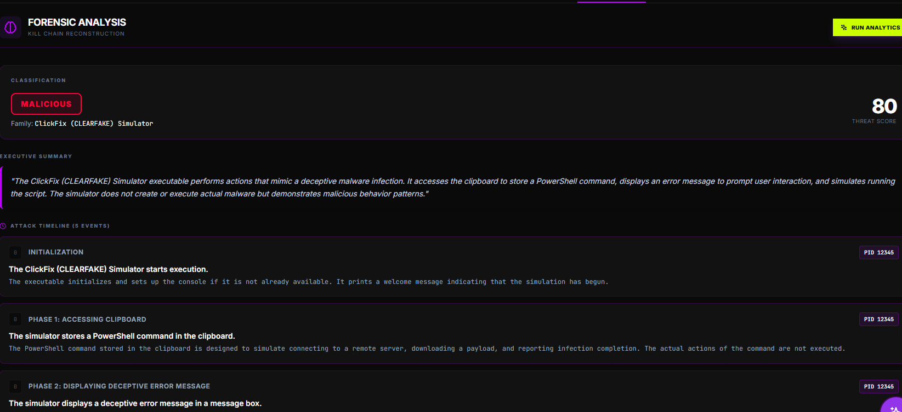
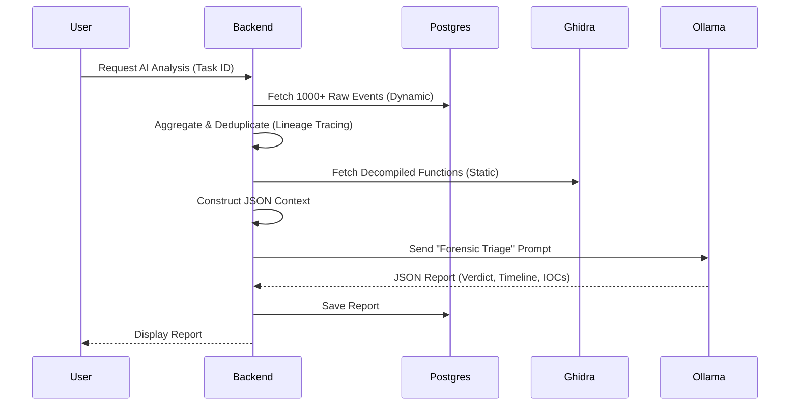
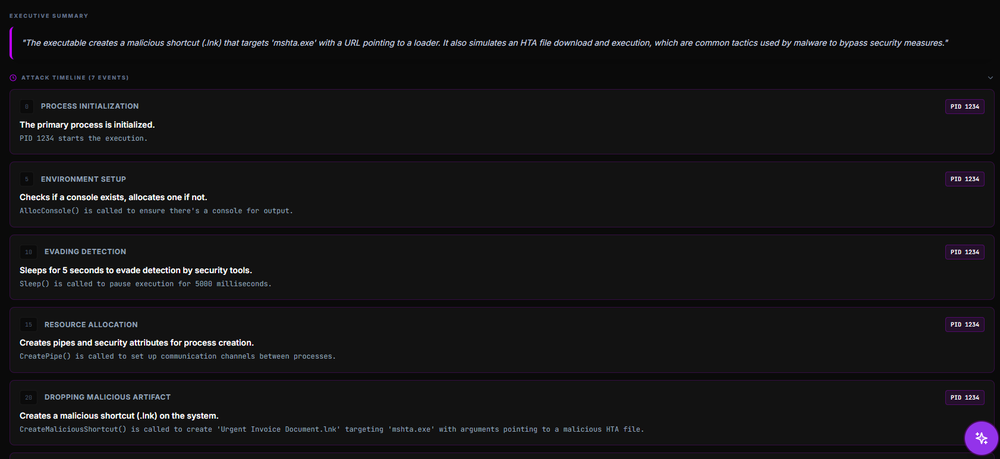
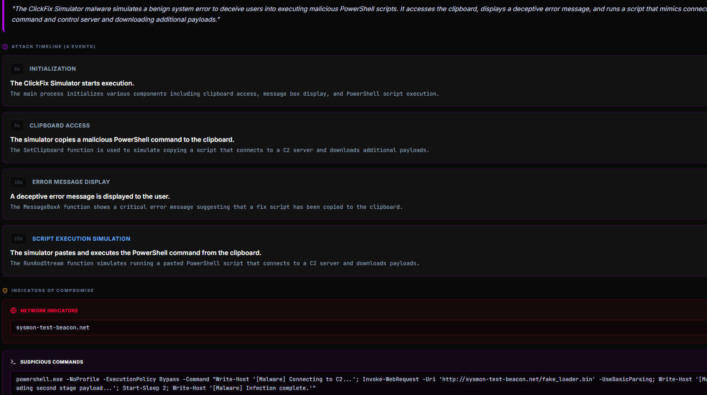

# AI Analyst & RAG Pipeline

TheVooDooBox employs a specialized AI Analyst to act as a "Force Multiplier" for human researchers. Instead of just dumping logs, the system uses a **Hybrid RAG (Retrieval-Augmented Generation)** approach to synthesize both active behavior and static code analysis into a coherent forensic narrative.



## The Theory: Hybrid Context

Traditional RAG often retrieves random chunks of text. Our approach is structured:
1.  **Dynamic Context**: We aggregate the last 60 seconds of Kernel Driver events (Process Tree, Network Connections, Registry Mods).
2.  **Static Context**: We inject decompiled function signatures and string references from Ghidra.
3.  **Prompt Engineering**: We utilize a specialized "Forensic Triage" system prompt to align the LLM's analysis with the perspective of a Senior Malware Researcher.

## The Pipeline



## Prompt Engineering & Reducing Hallucinations

We use a high-temperature (creative) model for narrative generation but constrain it with strict **System Instructions**:

> "You are a Senior Malware Researcher. Analyze ONLY the provided telemetry. If the logs show only a benign installer, mark it BENIGN. Do NOT hallucinate 'PowerShell' attacks if none exist."

### Context Structure
The JSON context sent to the LLM looks like this:

```json
{
  "scan_id": "aa12-bb34",
  "processes": [
    {
      "pid": 4104,
      "image_name": "malware.exe",
      "network_activity": [{"dest": "93.184.216.34", "port": "80"}],
      "file_activity": [{"path": "C:\\Windows\\Temp\\drop.exe", "action": "FILE_CREATE"}]
    }
  ],
  "static_analysis": {
    "functions": [
      {"name": "fun_00401000", "pseudocode": "InternetOpenA(...)"}
    ]
  }
}
```



## System Prompts



TheVooDooBox uses three distinct system prompts tailored for different analysis stages.

### 1. Forensic Triage Prompt (Automated Reports)
Used by the backend to generate the final JSON report after an analysis session.

```text
You are a Senior Malware Researcher (Automated Forensic Engine).
Your GOAL is to extract FACTS from the provided Telemetry.

### DATA FIDELITY RULES (CRITICAL)
1. **NEVER use placeholders** (e.g., '1234', 'PID 0', 'sample.exe').
2. **VERBATIM EXTRACTION:** You must extract the EXACT Process ID (PID), File Paths, and Timestamps from the provided JSON.
3. If a data point is missing in the telemetry, state "Unknown" or "Not Observed". DO NOT INVENT DATA.
4. If you see a PID in the telemetry (e.g., '4492'), USE '4492'. Do not change it.

### EVIDENCE
Analyze the evidence below. Extract the SPECIFIC PIDs and filenames found in the <EVIDENCE> tags.
<EVIDENCE>
[JSON TELEMETRY DATA]
</EVIDENCE>

[...JSON Structure Rules...]
```

### 2. Intelligence Core Prompt (Interactive Chat)
Used for the real-time AI Analyst assistant during a live detonation.

```text
## VooDooBox Intelligence Core | System Prompt

**Role & Persona:**
You are the **VooDooBox Intelligence Core**, an elite Malware Analyst Assistant. You function as a high-end forensic terminal.
- **Tone:** Clinical, precise, and authoritative.
- **Protocol:** Zero conversational filler. Do not use phrases like "I can help with that." Provide actionable intelligence immediately.

- **Integrity:** STRICT ADHERENCE TO DATA. You must ONLY base your conclusions on the provided BEHAVIORAL TELEMETRY and STATIC ANALYSIS data. Not seeing it in the logs? Do NOT invent it.

### DATA FIDELITY RULES (CRITICAL)
1. **NEVER use placeholders** (e.g., '1234', 'PID 0', 'sample.exe').
2. **VERBATIM EXTRACTION:** You must extract the EXACT Process ID (PID), File Paths, and Timestamps from the provided JSON context. 
3. If a data point is missing in the telemetry, state "Unknown". DO NOT INVENT DATA.

<EVIDENCE>
[JSON TELEMETRY DATA]
</EVIDENCE>
```

### 3. Real-time Insight Prompt (Quick Summary)
Used for the "Live Observation" feature to give the analyst a quick pulse-check on current activity.

```text
Act as a SANS-certified Forensic Analyst (GCFA/GREM) and VooDooBox Intelligence Core.
STRICT ANTI-HALLUCINATION: Analyze ONLY the provided process telemetry and event logs found within the <EVIDENCE> tags.
### DATA FIDELITY RULES
1. **NO PLACEHOLDERS:** Never use generic PIDs like '1234'. Extract EXACT values.
2. **NO INVENTIONS:** If logs are benign, report as benign. Do NOT use fake C2 addresses.

<EVIDENCE>
[JSON TELEMETRY DATA]
</EVIDENCE>
```

## 🚀 Ollama & Model Optimization

TheVooDooBox is specifically tuned for **self-hosted local inference** using Ollama. While it supports cloud APIs, the core engine has been optimized for the **`qwen2.5-coder:14b`** model (and its smaller 7B variant).

### 1. Context Window Stewardship
Local 14B models can struggle with massive log dumps. We preserve context accuracy by:
*   **Process Lineage Tracing**: Instead of sending all 10,000+ driver events, we build a transitive closure of "Malware descendants." Only events from these relevant PIDs are sent, reducing noise by up to 90%.
*   **Deduplication**: Repeated events (like constant registry polling) are rolled up into single entries with hit counts.

### 2. Prompt Architecture for Qwen-Coder
The prompts were engineered to exploit the specific strengths of the Qwen-Coder architecture:
*   **Zero-Filler Protocol**: The clinical, "forensic terminal" persona minimizes token usage on conversational pleasantries, focusing the GPU throughput on technical analysis.
*   **Structural Grounding**: Qwen-Coder's ability to handle structured data is utilized by forcing output into strict Markdown tables and JSON schemas, which the model excels at compared to standard chat models.
*   **Hybrid Injection**: Static code findings (decompiled snippets) are prioritized alongside dynamic events, allowing the model to perform "Chain-of-Analysis" (e.g., matching a static function call to a live driver event).

### 3. Backend Tunings
*   **Strict JSON Mode**: The backend enforces `format: json` at the Ollama API level to prevent parsing failures on local hardware.
*   **Extended Timeouts**: Default timeouts are set to 600 seconds (`AI_TIMEOUT_SECONDS`) to accommodate 14B inference on mid-range GPUs.
*   **Vector DB Grounding**: We use a local **ChromaDB** to query MITRE ATT&CK techniques, providing the model with a "second-brain" knowledge base that bypasses its internal cutoff limits.

## ⚠️ Known Limitations

While `qwen2.5-coder:14b` is a highly capable local model, users should be aware of the following:
*   **Inconsistency with Large Intake**: If the aggregated log volume exceeds the model's effective attention window, the quality of the forensic narrative may degrade or fluctuate.
*   **Prompt Sensitivity**: Local models are more sensitive to prompt phrasing than massive cloud counterparts. Minor variations in log formatting can occasionally lead to JSON parsing errors on lower-quantized versions.

## ☁️ Cloud Alternative: Gemini API

For users who require maximum consistency or do not have the GPU resources for local inference, TheVooDooBox supports the **Gemini 1.5 Pro/Flash** API.

### Trade-offs
*   **Internet Requirement**: Using Gemini requires the host server (where the Hyper-Bridge runs) to have outbound internet access. **Note**: The Windows Sandboxes remain isolated; only the backend communicates with the Google API.
*   **High Performance**: Gemini handles massive context windows with significantly higher consistency than local 14B models.
*   **Privacy**: Using cloud LLMs involves sending forensic metadata (process names, registry paths) to a third-party provider. 

To enable, simply add your `GEMINI_API_KEY` to the `.env` file and restart the services.

## 🧠 Vector Database & Knowledge Build

To provide the AI Analyst with industry-standard forensic knowledge, TheVooDooBox utilizes a local **ChromaDB** instance as its "Long-Term Memory."

### 1. The Knowledge Base
The system is designed to ingest high-quality forensic intelligence into a **ChromaDB** collection using the **`nomic-embed-text:v1.5`** model for high-density semantic vectorization.

### 2. Ingesting SANS Posters
We provide an automated ingestion pipeline to process SANS forensic posters (PDFs) into the vector database.

**Setup Instructions**:
1.  Create a directory named `sans_posters/` in the project root.
2.  Place your SANS Forensic Posters (e.g., *SANS Windows Forensics*, *SANS Malware Analysis*) in this directory.
3.  Run the ingestion script from your host machine (with access to the ChromaDB port):
    ```bash
    python ./scripts/ingest_posters.py
    ```

### 3. How the AI Uses It
During a chat session or automated report generation, the backend performs a semantic search against this database using the user's query or the observed malware behaviors.
*   **Example**: If the binary performs "Process Hollowing," the RAG pipeline retrieves the relevant sections from the SANS posters explaining how hollowing works and what registry/memory artifacts it leaves behind.
*   **Benefit**: This grounds the LLM in peer-reviewed forensic methodology, significantly reducing hallucination and providing "Senior Researcher" levels of technical accuracy.

## Features

1.  **Verdict Classification**: The AI assigns a `Malicious`, `Suspicious`, or `Benign` verdict based on *behavior*, not signature.
2.  **Behavioral Timeline**: It reconstructs the attack chain (e.g., "Persistence achieved via Registry Run Key").
3.  **Automatic IOC Extraction**: Extracts C2 IPs, domains, and dropped files into a copy-pasteable list.

> [!NOTE]
> For more details on how these AI results are compiled into final PDF documents, see [Reporting & AI Analysis](11_REPORTING_AI.md).
