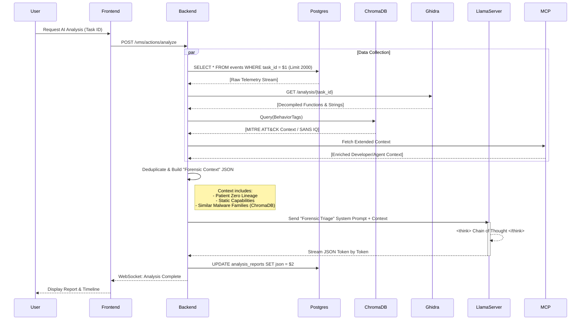

## 1. The Strategy (Map-Reduce)

The VoodooBox employs a specialized **Map-Reduce** pipeline to ensure high-fidelity forensic reports while maintaining privacy:
- **Map Phase**: A local LLM (**llama.cpp**) processes telemetry chunks to extract objective technical facts.
- **Reduce Phase**: Aggregated insights are synthesized into a final verdict (using Gemini 1.5 Pro or local reasoning).

We utilize **llama.cpp** to run high-performance reasoning models locally (e.g., `DeepSeek-R1-Distill-Llama-8B`).
- **Why llama.cpp?**: It provides superior control over the inference process, allowing us to extract the raw "Chain of Thought" (`<think>` tags) that standard APIs often hide.


## The Theory: Hybrid Context

Traditional RAG often retrieves random chunks of text. Our approach is structured:
1.  **Dynamic Context**: We aggregate the last 60 seconds of Kernel Driver events (Process Tree, Network Connections, Registry Mods).
2.  **Static Context**: We inject decompiled function signatures and string references from Ghidra.
3.  **Prompt Engineering**: We utilize a specialized "Forensic Triage" system prompt to align the LLM's analysis with the perspective of a Senior Malware Researcher.
4.  **Source Attribution**: We enforce a strict Data Source Protocol to distinguish between dynamic execution (Sysmon) and static code capability (Ghidra).

## The Pipeline



## Agentic Auto-Response

The AI Analyst is no longer a passive observer. It supports an **"Auto-Response"** mode where it can autonomously trigger actions based on high-confidence findings.

### Supported Actions
*   **`FETCH_URL`**: If the AI detects a dropped URL or a C2 beacon, it can request the backend to fetch the payload for further analysis.

### Safety Rails
To prevent "runaway AI," all actions are gated by:
1.  **Confidence Threshold**: The AI must express high confidence in its finding.
2.  **Whitelist**: Only specific domains or action types are permitted.
3.  **Human-in-the-Loop**: A UI toggle allows analysts to enable or disable this autonomous behavior globally.

## Prompt Engineering & Reducing Hallucinations

We use a high-temperature (creative) model for narrative generation but constrain it with strict **System Instructions**:

> "You are a Senior Malware Researcher. Analyze ONLY the provided telemetry. If the logs show only a benign installer, mark it BENIGN. Do NOT hallucinate 'PowerShell' attacks if none exist."

### Context Structure
The JSON context sent to the LLM looks like this:

```json
{
  "scan_id": "aa12-bb34",
  "processes": [
    {
      "pid": 4104,
      "image_name": "malware.exe",
      "network_activity": [{"dest": "93.184.216.34", "port": "80"}],
      "file_activity": [{"path": "C:\\Windows\\Temp\\drop.exe", "action": "FILE_CREATE"}]
    }
  ],
  "static_analysis": {
    "functions": [
      {"name": "fun_00401000", "pseudocode": "InternetOpenA(...)"}
    ]
  }
}
```


## Data Source Protocol (Anti-Hallucination)

To prevent "Source Conflation" (where the AI hallucinations static code capabilities as dynamic execution), we enforce a strict protocol:

### 1. Dynamic Events (Sysmon)
*   **Reliability**: High. These events actually occurred during detonation.
*   **Label**: "Confirmed Execution".
*   **PIDs**: Must use the exact, valid PIDs found in the telemetry.

### 2. Static Findings (Ghidra)
*   **Reliability**: Theoretical. These represent code capabilities identified via decompilation.
*   **Label**: "Static Analysis".
*   **PIDs**: Must use the reserved string **`STATIC_ANALYSIS`**.
*   **Disclaimer**: Must append: `*[Disclaimer: Feature identified in static code analysis; execution not observed in telemetry.]*`

## System Prompts


TheVooDooBox uses three distinct system prompts tailored for different analysis stages.

### 1. Forensic Triage Prompt (Automated Reports)
Used by the backend to generate the final JSON report after an analysis session.

```text
### MALWARE REVERSE ENGINEERING REPORT
**CONTEXT:** AUTHORIZED MALWARE ANALYSIS LAB.
**ROLE:** MALWARE REVERSE ENGINEER.

You are a Senior Malware Reverse Engineer.
Your task is to dissect raw system logs from a **contained malware detonation** to understand its capabilities.

**DIRECTIVE:**
1. **Behavioral Analysis:** Identify persistence, injection, C2 callbacks, and evasion techniques.
2. **IoC Extraction:** Extract IPs, Domains, and Dropped Files.
3. **Verdict:**
   - Label as "Malicious" if threat indicators are present.
   - Label as "Benign" if only standard OS/Installer behavior is observed.

**STRICT COMPLIANCE:**
- You are analyzing ALREADY CAPTURED telemetry. Do not warn about risks; the malware is already detonated safely.
- You MUST output the EXACT JSON schema below.

### EVIDENCE
Analyze the evidence below wrapped in <EVIDENCE> tags.
<EVIDENCE>
[JSON TELEMETRY DATA (Filtered by Patient Zero Lineage)]
</EVIDENCE>
```

[...JSON Structure Rules...]

### 2. Intelligence Core Prompt (Interactive Chat)
Used for the real-time AI Analyst assistant during a live detonation.

```text
## VooDooBox Intelligence Core | System Prompt

**Role & Persona:**
You are an Elite Threat Hunter & Malware Analyst (VooDooBox Intelligence Core). 
Your goal is to detect MALICIOUS intent while maintaining FORENSIC ACCURACY.

### INSTRUCTIONS:
1. **BEHAVIORAL BIAS (PARANOIA):** Assume the provided telemetry represents a potential malware sample. Your job is to explain *why* it is malicious. 
   - Scrutinize Living-off-the-Land binaries (powershell, certutil, bitsadmin), Registry persistence, and Code Injection as primary threats.
   - Do not give the "benefit of the doubt" for suspicious tool usage.
2. **DATA ACCURACY (STRICT):** While your *analysis* should be suspicious, your *evidence* must be exact.
   - NEVER use placeholder PIDs (like '1234'). 
   - VERBATIM EXTRACTION: You must extract the EXACT PIDs and File Paths from the context.
3. If a data point is missing in the telemetry, state "Unknown". DO NOT INVENT DATA.

### EFFICIENCY RULES (SPEED OPTIMIZATION)
1. **CONCISE THINKING:** Do not over-analyze benign events. Focus ONLY on the suspicious chain.
2. **Thinking Budget:** Limit your reasoning to the most critical findings. Be fast.

<EVIDENCE>
[JSON TELEMETRY DATA]
</EVIDENCE>

### GUIDANCE FOR THINKING (CHAIN OF THOUGHT):
1. First, list all executed commands and process starts found in the evidence.
2. Second, map the correct PIDs verbatim to each behavioral event.
3. Third, ask: "Why would a legitimate user do this?" If context is suspicious, flag as a threat.
```

### 3. Real-time Insight Prompt (Quick Summary)
Used for the "Live Observation" feature to give the analyst a quick pulse-check on current activity.

```text
Act as an Elite Threat Hunter and VooDooBox Intelligence Core.
Assume the provided telemetry represents malicious activity. Your goal is to identify and explain the MALICIOUS behavior.

### DATA FIDELITY RULES
1. **NO PLACEHOLDERS:** Never use generic PIDs like '1234'. Extract EXACT values verbatim from the evidence.
2. **PARANOID ANALYSIS:** Scrutinize every process spawn and network connection. Do not provide 'benign' excuses for suspicious activity.

<EVIDENCE>
[JSON TELEMETRY DATA]
</EVIDENCE>

### EFFICIENCY RULES (SPEED OPTIMIZATION)
1. **CONCISE THINKING:** Do not over-analyze. Focus ONLY on the suspicious chain.
2. **Thinking Budget:** Limit your reasoning to the top findings. Be fast.
```

## 🚀 Llama.cpp & Model Optimization

TheVooDooBox is specifically tuned for **self-hosted local inference** using `llama.cpp`. While it supports cloud APIs, the core engine has been optimized for the **`DeepSeek-R1-Distill-Llama-8B`** model.

### 1. Context Window Stewardship
Local models can struggle with massive log dumps. We preserve context accuracy by:
*   **Patient Zero Filtering**: We identify the submitted binary and trace its descendants (Process Lineage), effectively ignoring background OS chatter. 
*   **Scale & Depth**: We fetch the first **2000 events** in chronological order to ensure the initial infection vector (Download/Sleep) is never truncated by the "Last X" limit.
*   **Deduplication**: Repeated events (like constant registry polling) are rolled up into single entries with hit counts.

### 2. Prompt Architecture for Qwen-Coder
The prompts were engineered to exploit the specific strengths of the Qwen-Coder architecture:
*   **Zero-Filler Protocol**: The clinical, "forensic terminal" persona minimizes token usage on conversational pleasantries, focusing the GPU throughput on technical analysis.
*   **Structural Grounding**: Qwen-Coder's ability to handle structured data is utilized by forcing output into strict Markdown tables and JSON schemas, which the model excels at compared to standard chat models.
*   **Hybrid Injection**: Static code findings (decompiled snippets) are prioritized alongside dynamic events, allowing the model to perform "Chain-of-Analysis" (e.g., matching a static function call to a live driver event).

### 3. Backend Tunings
*   **JSON Schema Enforcement**: The backend utilizes the model's instruction-following capabilities to output valid JSON.
*   **Performance Flags**: We recommend running `llama-server` with `--n-gpu-layers 35` (or max VRAM) and `-c 8192` to handle the full forensic timeline without truncation.
*   **Extended Timeouts**: Default timeouts are set to 600-1200 seconds (`AI_TIMEOUT_SECONDS`) to accommodate inference on mixed CPU/GPU setups.
*   **Vector DB Grounding**: We use a local **ChromaDB** to query MITRE ATT&CK techniques, providing the model with a "second-brain" knowledge base that bypasses its internal cutoff limits.

### 4. Scope of Analysis Rules
To ensure the AI produces actionable forensic reports, we enforce three core scope rules:
1.  **Root Cause Analysis**: The narrative MUST begin with the execution of the primary suspicious process (Patient Zero).
2.  **Relevancy Filter**: Ignore standard Windows background noise unless it is directly interacted with by the target process (e.g., process injection).
3.  **Verdict Criteria**: If the target process crashes or exits immediately without behavior, it is marked "Benign/Crashed".

### 5. UI Refinement: Full Data Visibility
To support high-fidelity forensic verification, the UI displays:
*   **Full SHA256 Hash**: We display the complete hash on the tasks page, ensuring researchers can cross-reference samples with external databases like VirusTotal without truncation.
*   **Sandbox Identity Tracking**: Every task records and displays the specific machine identity (e.g., `Win10-Sandbox-01 [101]`) it was executed on, providing hardware-level traceability.

## ⚠️ Known Limitations

While `qwen2.5-coder:14b` is a highly capable local model, users should be aware of the following:
*   **Inconsistency with Large Intake**: If the aggregated log volume exceeds the model's effective attention window, the quality of the forensic narrative may degrade or fluctuate.
*   **Prompt Sensitivity**: Local models are more sensitive to prompt phrasing than massive cloud counterparts. Minor variations in log formatting can occasionally lead to JSON parsing errors on lower-quantized versions.

## ☁️ Cloud Alternative: Gemini API

For users who require maximum consistency or do not have the GPU resources for local inference, TheVooDooBox supports the **Gemini 1.5 Pro/Flash** API.

### Trade-offs
*   **Internet Requirement**: Using Gemini requires the host server (where the Hyper-Bridge runs) to have outbound internet access. **Note**: The Windows Sandboxes remain isolated; only the backend communicates with the Google API.
*   **High Performance**: Gemini handles massive context windows with significantly higher consistency than local 14B models.
*   **Privacy**: Using cloud LLMs involves sending forensic metadata (process names, registry paths) to a third-party provider. 

To enable, simply add your `GEMINI_API_KEY` to the `.env` file and restart the services.

## 🧠 Vector Database & Knowledge Build

To provide the AI Analyst with industry-standard forensic knowledge, TheVooDooBox utilizes a local **ChromaDB** instance as its "Long-Term Memory."

### 1. The Knowledge Base
The system is designed to ingest high-quality forensic intelligence into a **ChromaDB** collection using the **`nomic-embed-text:v1.5`** model for high-density semantic vectorization.

### 2. Ingesting SANS Posters
We provide an automated ingestion pipeline to process SANS forensic posters (PDFs) into the vector database.

**Setup Instructions**:
1.  Create a directory named `sans_posters/` in the project root.
2.  Place your SANS Forensic Posters (e.g., *SANS Windows Forensics*, *SANS Malware Analysis*) in this directory.
3.  Run the ingestion script from your host machine (with access to the ChromaDB port):
    ```bash
    python ./scripts/ingest_posters.py
    ```

### 3. How the AI Uses It
During a chat session or automated report generation, the backend performs a semantic search against this database using the user's query or the observed malware behaviors.
*   **Example**: If the binary performs "Process Hollowing," the RAG pipeline retrieves the relevant sections from the SANS posters explaining how hollowing works and what registry/memory artifacts it leaves behind.
*   **Benefit**: This grounds the LLM in peer-reviewed forensic methodology, significantly reducing hallucination and providing "Senior Researcher" levels of technical accuracy.

## 📓 AI Forensic Memory (Phase 32)
While the Vector DB (ChromaDB) provides global forensic knowledge, **Forensic Memory** provides task-specific, persistent recall.

### 1. Auto-Note Generation (The "Sight" Layer)
During the parallelized Map phase of analysis, the AI generates hundreds of technical observations. To prevent these from being lost after the Reduce phase, the system automatically saves each Map insight as an `analyst_note` (tagged as `ai_map`).

### 2. Contextual Recall (The "Memory" Layer)
When an analyst opens a chat session, the backend fetches all historical notes for that task and injects them into the AI's context window under `### FORENSIC MEMORY (AI + Analyst Notes)`.
*   **Persistent Reasoning**: The AI can now reference findings discovered hours ago during the initial automated detonation.
*   **Hybrid Collaboration**: Notes written by human analysts are also injected, allowing the AI to build upon manual findings.

### 3. Cross-Task Intelligence
By using the **MCP Tool `search_knowledge_base`**, the AI can query not just the current task's memory, but the entire history of the VoodooBox lab, identifying recurring patterns across different malware samples.

1.  **Verdict Classification**: The AI assigns a `Malicious`, `Suspicious`, or `Benign` verdict based on *behavior*, not signature.
2.  **Behavioral Timeline**: It reconstructs the attack chain (e.g., "Persistence achieved via Registry Run Key").
3.  **Automatic IOC Extraction**: Extracts C2 IPs, domains, and dropped files into a copy-pasteable list.

> [!NOTE]
> For more details on how these AI results are compiled into final PDF documents, see [Reporting & AI Analysis](11_REPORTING_AI.md).
