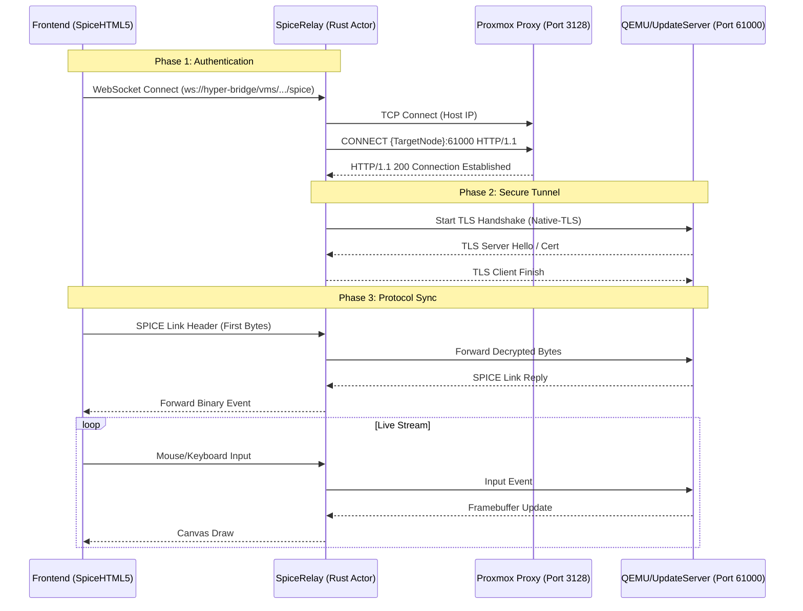
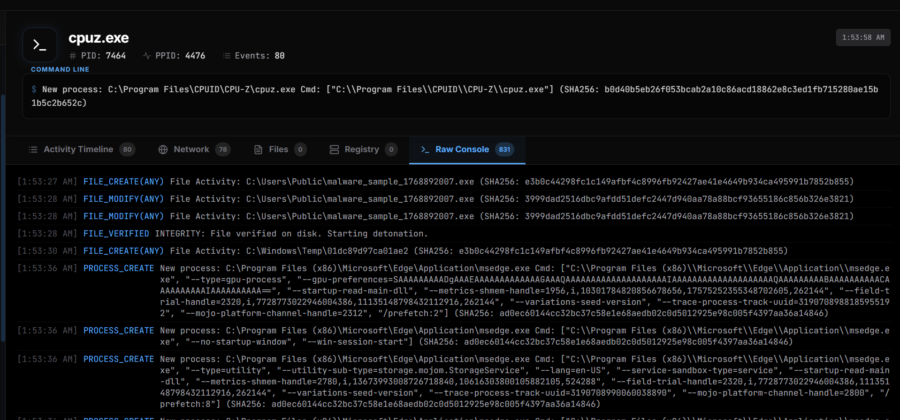

# VNC & SPICE Integration

To provide the **Pixel** part of our "Kernel-to-Pixel" vision, TheVooDooBox integrates directly with Proxmox's remote console APIs. This allows analysts to interact with malware in real-time without needing direct network access to the guest VM.

> [!WARNING]
> **STABILITY DISCLAIMER**: The VNC/SPICE integration is currently considered **experimental** and may be buggy. Due to the complex nature of how Proxmox handles WebSocket-to-TCP proxying and the sensitive timing requirements of the SPICE protocol, sessions may occasionally disconnect or fail to initialize correctly. If issues persist, consider using the standalone Proxmox console as a fallback.

## 1. Connection Workflow

The connection process follows a three-step handshake between the Frontend, the Hyper-Bridge, and the Proxmox Host.





## 2. Proxmox API Layer (`proxmox.rs`)

The `ProxmoxClient` handles the initial authentication and ticket generation.

### VNC Proxy (`vncproxy`)
When using VNC (noVNC compatible), we request a ticket via:
*   **Endpoint**: `POST /nodes/{node}/qemu/{vmid}/vncproxy`
*   **Parameters**: `websocket=1`, `generate-password=1`.
*   **Response**: A `VncTicket` containing:
    *   `ticket`: The ephemeral password for the session.
    *   `port`: The internal VNC port.
    *   `upid`: A unique task ID in Proxmox.

### SPICE Proxy (`spiceproxy`)
SPICE is the preferred high-performance protocol.
*   **Endpoint**: `POST /nodes/{node}/qemu/{vmid}/spiceproxy`
*   **Response**: A `SpiceTicket` containing:
    *   `proxy`: The address of the PVE SPICE proxy (usually the host IP).
    *   `password`: Used as the SPICE session ticket.
    *   `tls-port`: 61000 (standard for encrypted SPICE).

## 3. The Hyper-Bridge Relay (`spice_relay.rs`)

Because browsers cannot speak the native SPICE/VNC protocols directly over TCP, the Hyper-Bridge acts as a **WebSocket-to-TCP Relay**.

### SPICE Relay Logic
The `SpiceRelay` (an Actix Actor) performs several critical transformations:

1.  **HTTP CONNECT Tunneling**: To reach the internal SPICE port on the Proxmox node through the PVE firewall, the relay connects to the Proxmox Host (Port 8006/3128) and sends:
    ```http
    CONNECT {target_vm_host}:61000 HTTP/1.1
    Host: {target_vm_host}:61000
    ```
2.  **TLS Over Tunnel**: Once the HTTP tunnel is established, Proxmox expects a TLS handshake on the SPICE stream (on port 61000). The `SpiceRelay` uses `tokio-native-tls` to wrap the raw TCP stream in a secure layer.
3.  **Initial Handshake Wait**: The SPICE server is sensitive to timing. The relay waits for the initial handshake packet from the WebSocket client (the browser) before forwarding the first set of bytes to the server, ensuring the SPICE protocol sequence remains valid.
4.  **Bi-directional Buffering**: A high-speed `mpsc::unbounded_channel` handles the flow of binary packets (mouse movements, screen updates) with millisecond latency.

## 4. Frontend Implementation

*   **VNC**: Uses a tailored version of `noVNC` embedded in the `VncViewer` component.
*   **SPICE**: Uses `spice-html5` integrated into `SpiceViewer`. 
*   **Automatic Scaling**: The UI automatically scales the remote resolution to fit the "Analysis Arena" workspace.

## 5. Security Note

All console tickets generated are **ephemeral** and expire shortly after generation if no connection is established. The credentials never leave the memory of the Hyper-Bridge and are only passed to the specific authenticated session of the analyst.
