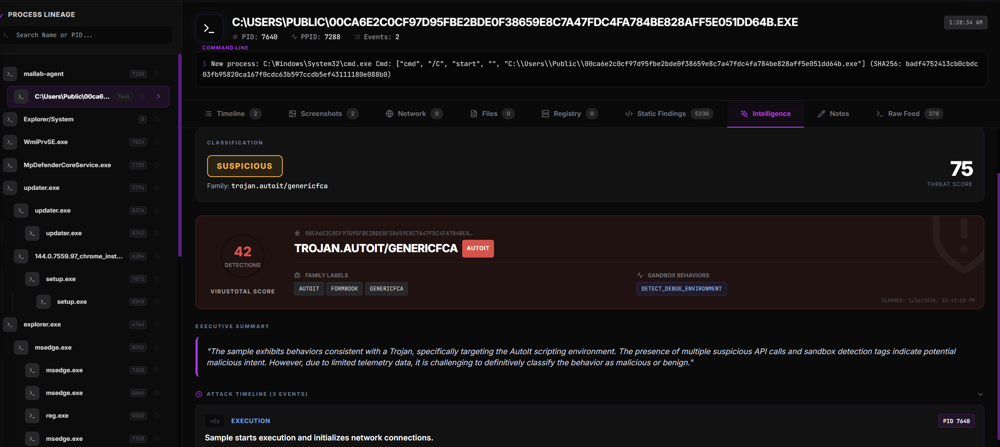
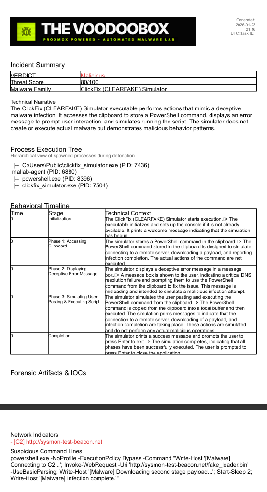

# Reporting & AI Analysis Pipeline

TheVooDooBox is designed to transform thousands of raw kernel events into a single, actionable forensic report. This process involves sophisticated data aggregation, LLM-based triage, and automated document generation.

## 1. The Data Pipeline

The path from execution to report follows these logical stages:

1.  **Event Capture**: "The Eye" driver captures raw behavioral data.
2.  **Aggregation**: The backend filters noise and builds a **Process Lineage** (identifying the malware and all its descendants).
3.  **Context Enrichment**: Ghidra static findings (decompiled functions) are merged with the dynamic behavioral data.
4.  **Threat Corroboration**: VirusTotal intelligence is fetched and injected to validate findings.
5.  **AI Synthesis**: An LLM analyzes the hybrid context to produce a structured `ForensicReport`.
6.  **Artifact Generation**: The system compiles a professional PDF for human review.

## 2. Telemetry Aggregation (`ai_analysis.rs`)

To avoid overwhelming the AI, we use a specialized aggregation logic:

*   **Process Lineage Tracing**: We identify "Patient Zero" (the initial malware process) and recursively track every child process spawned during the session.
*   **High-Value Filtering**: Aggressively drops noise events. Only critical Sysmon IDs (1, 3, 8, 11) from descending lineages are preserved, reducing log volume by ~95%.
*   **PID Menu Generation**: The backend extracts all valid PIDs from the telemetry and injects them as a "Factual Cheat Sheet" into the AI prompt. This ensures the AI never hallucinates process IDs.
*   **Cross-Platform Signature Fallback**: Validating digital signatures on a Linux backend is technically limited. To solve this, the system uses a **Hybrid Fallback**:
    1.  **Local Check**: Backend attempts to check the local sample via PowerShell (if path is accessible).
    2.  **Telemetry Recovery**: If the local check fails or the platform is incompatible, the backend scans the incoming agent telemetry for that specific task. Since the Windows Agent extracts signatures in real-time, the backend "recovers" this data and injects it into the AI's context.

## 3. The AI Forensic Triage (Paranoid Mode)

The backend constructs a high-density JSON payload containing the aggregated process activity and Ghidra findings. This is analyzed by the **Elite Threat Hunter** persona:

### Behavioral Bias (Detective Mode)
The AI is instructed to assume the provided telemetry represents malicious activity. It scrutinizes "benign-looking" tool usage (like `powershell`, `certutil`, `bitsadmin`) for malicious context, ensuring it identifies threats that simpler models might miss.

### Data Fidelity (Clerk Mode)
While the analysis is "paranoid," the identifiers must be exact. The AI is strictly forbidden from using placeholder data and must map every observation back to the **PID Menu** provided in the prompt.

### Efficiency Rules
Reasoning is capped with a "Thinking Budget" to avoid loops, ensuring reports are generated within 45-120 seconds even on mid-range hardware.

### AI Output Structure
The AI is instructed to return a JSON object with:
*   **Verdict**: Malicious, Suspicious, Benign, or **Diagnostic** (for low-confidence/incomplete traces).
*   **Malware Family**: Identified threat actor or tool.
*   **Executive Summary**: A high-level technical narrative explaining the attack.
*   **Recommended Actions**: A list of automated or manual response steps (e.g., `FETCH_URL`).
*   **Behavioral Timeline**: A chronological reconstruction of significant events with exact PID mappings.
*   **Extracted IOCs**: C2 IPs, domains, and paths of dropped files.

## 4. Automated PDF Reporting (`reports.rs`)

Once the AI report is finalized, the `genpdf` engine generates a forensic document.

### Report Components
*   **Visual Branding**: Custom header with the VoodooBox logo and task metadata.
*   **Verdict Panel**: Color-coded risk assessment (Red/Orange/Green).
*   **Interactive Timeline**: Table view of the attack stages identified by the AI.
*   **Process Tree**: A visual representation of the execution flow, highlighting suspicious PIDs in red.
*   **Threat Intelligence**: VirusTotal detection scores, behavior tags, and family labels.
*   **Artifact List**: Categorized list of Indicators of Compromise (IOCs) for rapid security team response.

*Figure: VirusTotal data is automatically correlated with behavioral telemetry to provide high-fidelity verdicts.*

## 5. Persistence & Retrieval

All reports are stored in the PostgreSQL `analysis_reports` table and the PDF files are saved locally to the `/reports` directory. Analysts can retrieve previous reports via:
*   **UI**: Clicking "View Report" on any completed task.
*   **API**: `GET /api/tasks/{task_id}/ai-report`
*   **FileSystem**: Browsing the persisted PDF volumes.
