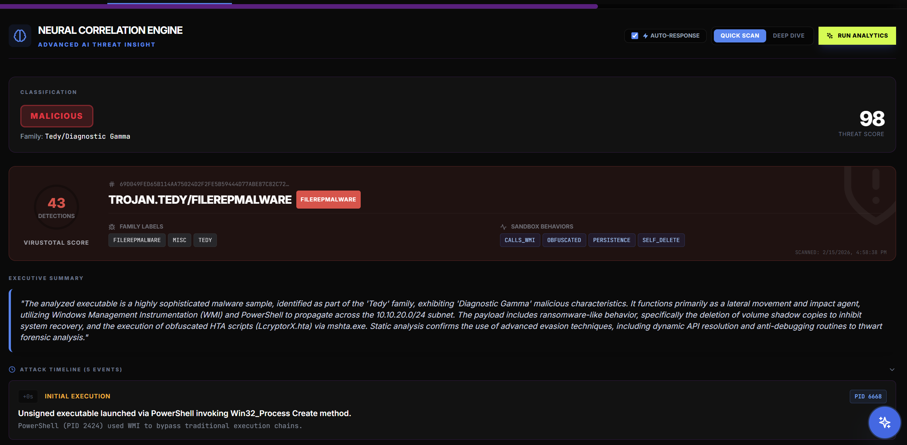
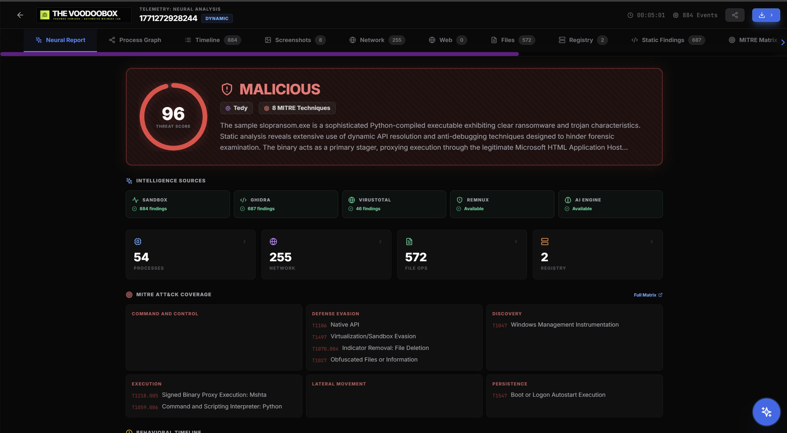

# Understanding AI Forensic Reports

## The Verdict System

The AI assigns one of three verdicts to every analyzed binary:

1.  **[Diagnostic Alpha] (Benign)**
    - **Color**: Green
    - **Meaning**: No malicious indicators found. Safe to run.
    - *Common in*: Valid Signed Installers, System Tools.

2.  **[Diagnostic Beta] (Suspicious)**
    - **Color**: Yellow
    - **Meaning**: Anomalous behavior detected (e.g., modifying registry keys, network connections to unknown IPs), but no definitive malicious payload.
    - *Action*: Proceed with caution. Further manual analysis recommended.

3.  **[Diagnostic Gamma] (Malicious)**
    - **Color**: Red
    - **Meaning**: Confirmed malicious activity (e.g., C2 beaconing, Ransomware encryption, Process Injection).
    - *Action*: Isolate and remediate immediately.

## Threat Score Calculation

The Threat Score (0-100) is a weighted average based on:
- **Heuristics**: Number of high-severity Sysmon events (Process Create, Network Connect).
- **Static Analysis**: Presence of high-risk APIs (e.g., `VirtualAlloc`, `CreateRemoteThread`).
- **AI Confidence**: The LLM's internal certainty based on the correlation of evidence.

## 3. The "Deep Thinking" Mechanism

VoodooBox leverages the latest reasoning models (like DeepSeek-R1) via `llama.cpp`. This allows for a "Chain of Thought" process that mimics a human analyst.

### How it Works
1.  **Prompt Engineering**: The backend injects a strict system prompt: "You are a malware analyst. Before answering, you must output your thinking process in a `<think>` block."
2.  **Inference (llama.cpp)**: The model receives the JSON telemetry and Ghidra pseudocode. It begins by "talking to itself":
    - *"I see a connection to IP 1.2.3.4, but is it malicious?"*
    - *"Let me check the Ghidra function `FUN_00401` called right before."*
    - *"The function uses `InternetOpenUrlA`, confirming the intent."*
3.  **Parsing**: The backend detects the `<think>...</think>` tags (or heuristic equivalent) and extracts this inner monologue.
4.  **Presentation**: This "raw thought" is displayed in the **Forensic Reasoning** console, separate from the final structured JSON report.
- **Verify**: Check if the AI hallucinated a connection or correctly cited a PID.
- **Learn**: Understanding *why* a set of API calls is considered malicious.
- **Debug**: If the AI gives a wrong verdict, the reasoning log will usually reveal the flawed assumption.

## Dealing with "Unknown" Families

If the AI cannot identify a specific malware family (e.g., "Emotet"), it will label the family as **"Unknown"** but still provide a verdict based on behavior. This is common for novel or custom malware.
