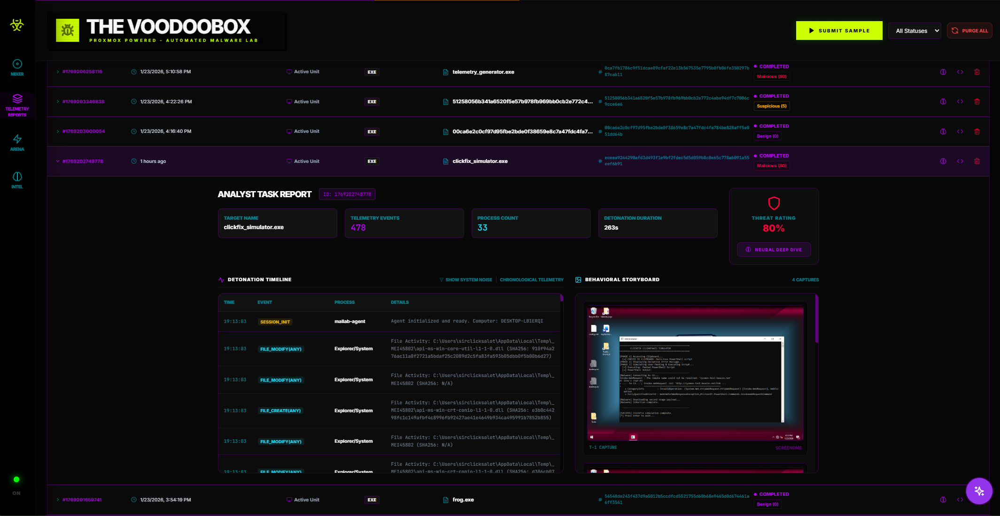
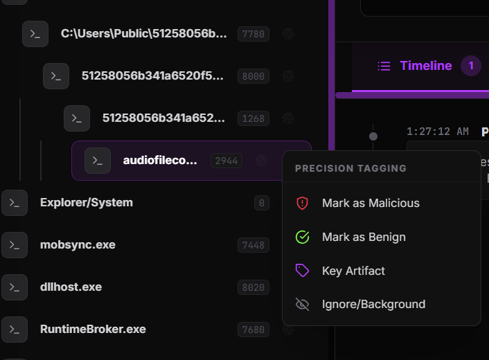

# Frontend Dashboard: The Analyst Interface

TheVooDooBox Frontend is a real-time React application designed to provide malware analysts with a "Pixel-Perfect" window into the sandbox telemetry.


## 🏗️ Architecture & Tech Stack

*   **Framework**: [React](https://react.dev/) 18+ with [TypeScript](https://www.typescriptlang.org/).
*   **Build Tool**: [Vite](https://vitejs.dev/) for near-instant hot module replacement (HMR).
*   **Styling**: [TailwindCSS](https://tailwindcss.com/) for a modern, responsive, and clinical dark-mode aesthetic.
*   **State Management**: React Hooks and Context for local UI state; WebSocket listeners for real-time telemetry.
*   **VNC/SPICE**: Integrated [noVNC](https://kanaka.github.io/noVNC/) and custom SPICE clients for the VM console.

## 📱 Core Pages

### 1. Lab Dashboard (`LabDashboard.tsx`)
The "Executive View." It provides an overview of the entire laboratory infrastructure.
*   **VM Carousel**: Real-time power status and thumbnail previews of all Proxmox nodes.
*   **Task History**: A filterable list of recent analysis sessions with their AI-generated verdicts.
*   **Sample Submission**: A centralized portal to upload binaries or URLs for detonation.

### 2. Analysis Arena (`AnalysisArena.tsx`)
The core workspace for an active malware dissection.
*   **Live Stream**: The VNC/SPICE console allowing direct interaction with the malware.
*   **Telemetry Feed**: A high-speed scrolling list of kernel events (Processes, Files, Network).
*   **Process Tree**: A dynamic visualization of the process lineage (Parent -> Child relationships).
*   **MCP Console**: Interface to trigger manual lab actions like snapshot rollbacks.



### 3. Report View (`ReportView.tsx`)
The final forensic summary for a completed task.
*   **Verdict Badge**: High-visibility Malicious/Suspicious/Benign classification.
*   **Forensic Timeline**: A chronological reconstruction of the attack chain.
*   **IOC Export**: A copy-paste ready list of IPs, domains, and file hashes.

### 4. Analyst Toolkit (New)
Advanced features for manual verification and collaboration.

#### Precision Tagging
Analysts can manually tag specific process events to guide the investigation or train the AI.
*   **Access**: Click the **Fingerprint Icon** on the far right of any event row, or right-click the row.
*   **Tags**:
    *   🛡️ **Mark as Malicious**: Highlights the event in red and flags it as a critical threat.
    *   ✅ **Mark as Benign**: Greys out the event, effectively filtering it from the threat feed.
    *   🏷️ **Key Artifact**: Marks the event as a pivotal moment in the attack chain (e.g., the initial payload drop).
    *   👁️ **Ignore/Background**: Hides the event from the main view to reduce noise.


*Figure: The Precision Tagging menu allows for granular event classification.*


*Figure: Tagging a specific process creation event in the telemetry timeline.*

#### Collaborative Notepad
A slide-out drawer for persistent, task-specific notes.
*   **Access**: Click the **Pencil Icon** in the top navigation bar.
*   **Function**: Notes are auto-saved to the backend and synced in real-time for all analysts viewing the task.

#### Intelligence Integration
*   **VirusTotal**: Hashes are automatically checked against cached VirusTotal data. Results (Detection Ratio, Vendor Verdicts) are displayed in the **AI Insight Panel**.


*Figure: The Intelligence tab showing automated VirusTotal attribution and threat scoring.*


## 🤖 AI Interaction Components

### Intelligence Core Chat (`FloatingChat.tsx`)
A persistent AI interface that allows analysts to query the **Intelligence Core** without leaving the live stream. It utilizes a "Terminal" style aesthetic, providing clinical and fast forensic intelligence.

### AI Insight Panel (`AIInsightPanel.tsx`)
A side-panel in the Analysis Arena that provides automated, high-level summaries of the current session.
*   **Threat Visualization**: Integration of VirusTotal data via `VirusTotalCard` for rapid attribution.
*   **Pulse Checks**: Real-time assessments as events unfold.

## 📐 Design Philosophy

*   **Low Latency**: Every millisecond matters when watching a malware execution. Telemetry is streamed over WebSockets and rendered using virtualized lists to handle thousands of events without lag.
*   **Clinical Aesthetic**: Using a deep-dark theme (`bg-slate-950`) with high-contrast accent colors (Red for Malicious, Green for Benign) to reduce eye strain during long forensic sessions.
*   **Context Priority**: The UI is designed to keep the most important context (the live VM screen and the process tree) always visible, with secondary data secondary panels.

## 🛠️ Development & Build

### Running Locally
```bash
cd frontend
npm install
npm run dev
```

### Environment Variables
*   `VITE_BACKEND_URL`: URL of the Hyper-Bridge API.
*   `VITE_WS_URL`: WebSocket endpoint for the telemetry stream.
