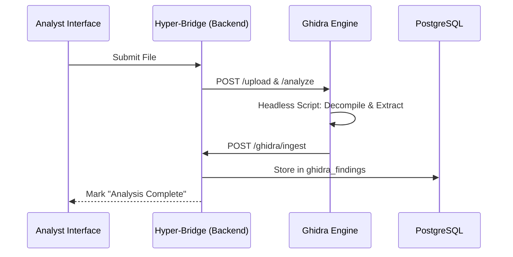

# Ghidra Static Analysis Integration

TheVooDooBox bridges the gap between static and dynamic analysis by integrating **Ghidra**, the industry-standard reverse engineering suite. This allows the platform to correlate low-level code patterns with live kernel behavior.

## 🏗️ How it Works

The integration consists of three main components:

1.  **Ghidra Static Engine**: A standalone Docker service (`ghidra-static-engine`) running a headless version of Ghidra.
2.  **Automated Ingestion**: Headless scripts that extract decompiled functions and assembly, pushing them to the central database.
3.  **Hybrid context**: The backend merges these static findings with dynamic kernel telemetry before sending it to the AI Analyst.

### The Analysis Pipeline

## 🤖 Using Ghidra with AI Chat

The most powerful feature of this integration is the ability to ask the **AI Analyst** questions about the code while watching it execute.

### 1. Context Injection
When you open a chat session for a task, the backend automatically queries the `ghidra_findings` table. It selects the most relevant decompiled functions (often those involving suspicious APIs like `VirtualAllocEx` or `InternetConnect`) and injects them into the LLM's system prompt.

### 2. Example Analyst Queries
Because the AI "knows" the code, you can ask specific technical questions:

*   *"Does the decompiled code for `FUN_00401234` explain why we see network activity to this IP?"*
*   *"Is there any obfuscation or string encryption loop in the `main` function?"*
*   *"Look at the Ghidra findings; does this binary attempt to detect a debugger?"*

### 3. Verification
The AI Analyst will cross-reference the **Dynamic Behavior** (e.g., *"Process spawned cmd.exe"*) with the **Static Logic** (e.g., *"Function X calls ShellExecuteA"*) to provide a confident forensic verdict.

## 🛠️ Configuration & Customization

### Headless Scripts
Located in `ghidra/scripts/`, these Java and Python scripts control the automation:
*   `AnalyzeAndIngest.py`: The primary entry point that triggers standard Ghidra analysis.
*   `GetFunctions.java`: Extracts the list of reachable functions and their entry points.
*   `DecompileFunction.java`: Uses the Ghidra Decompiler API to generate C-like pseudocode.

### Environment Variables
You can tune the engine via the `.env` file:
*   `GHIDRA_API_INTERNAL`: The internal URL for the backend to reach the engine.
*   `GHIDRA_BINARIES_DIR`: Where submitted samples are temporarily stored for analysis.
