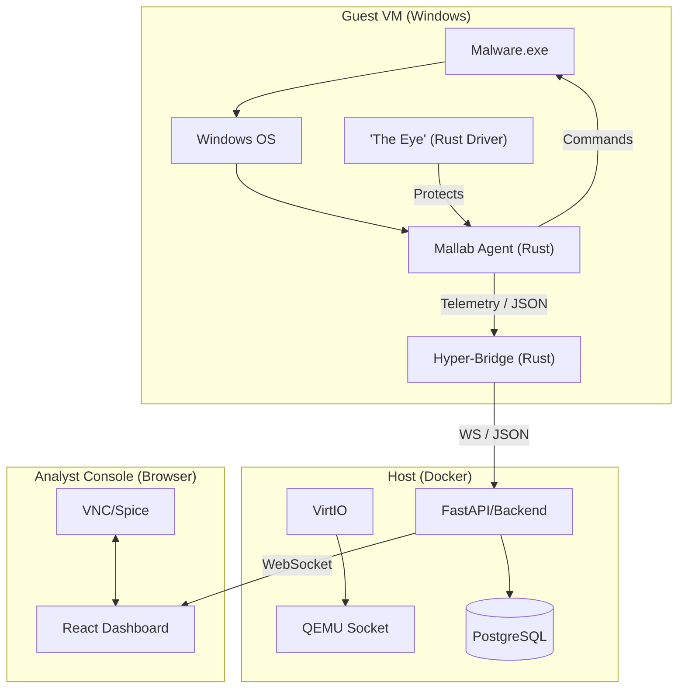

# TheVooDooBox Architecture

MallabV3 is designed for **high-fidelity, real-time telemetry**. Unlike traditional sandboxes that use "snapshot-and-report" workflows, MallabV3 streams events as they happen from the heart of the guest OS.

## System Overview

## Core Components

### 1. The Eye (Kernel Driver)
Written in Rust using the `wdk` crate, this driver provides **Anti-Tamper protection** for the Mallab Agent. It:
- Protects the agent process from being terminated by malware.
- Provides a secure bridge for future kernel-level telemetry extensions.

### 2. Mallab Agent
A high-performance user-mode service that provides the bulk of the platform's telemetry:
- **Process Monitoring**: Captures creation, termination, and suspicious activity.
- **File System Watching**: Monitors critical paths with SHA256 hashing.
- **Network Telemetry**: Tracks TCP connections and DNS queries.
- **Memory Forensics**: Scans for process hollowing and memory anomalies.
- **Command Execution**: Handles remote commands (kill, exec, download).

### 3. Hyper-Bridge (Backend)
The "heart" of the system, built with Rust. It:
- Ingests raw events from the VirtIO serial port.
- Multiplexes streams for multiple concurrent analyses.
- Provides a WebSocket interface for the frontend.

### 4. Interactive UI
A modern React-based dashboard that features:
- **Live Stream**: A forensic timeline updated in real-time.
- **Process Tree**: Visual representation of the malware's family tree.
- **VNC Integration**: Direct interaction with the sample.
